# Облачные технологии в обработке больших данных

## 1. Введение: Эволюция облачных вычислений для Big Data

### Исторический контекст перехода к облаку

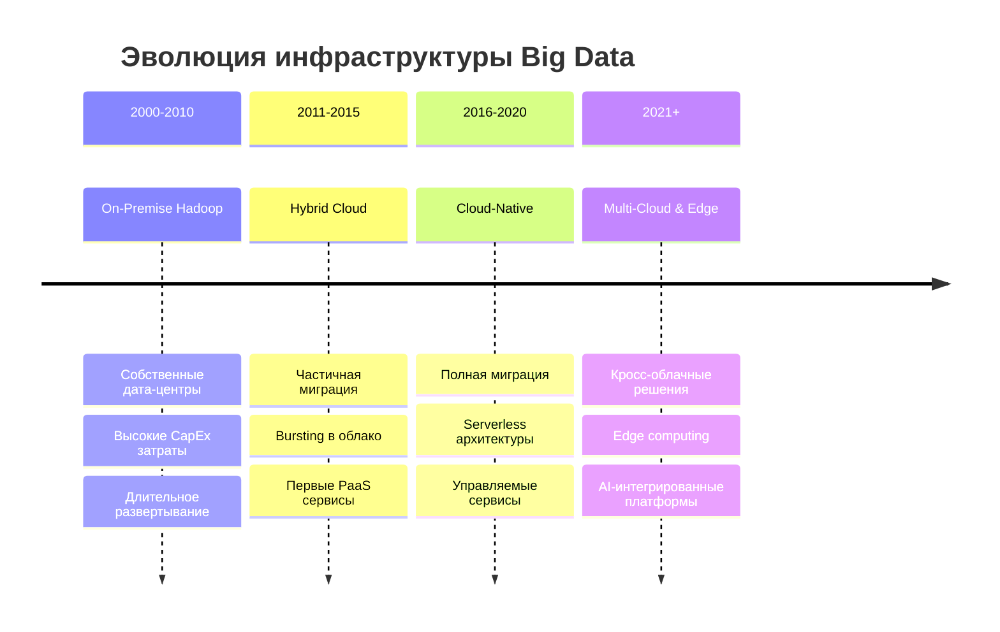

**Описание схемы 1: Эволюция инфраструктуры Big Data**
Данная временная шкала показывает историческую эволюцию подходов к обработке больших данных. 
- **2000-2010: On-Premise Hadoop** - Эра локальных дата-центров с высокими капитальными затратами (CapEx), где компании покупали и обслуживали собственное оборудование. Развертывание занимало месяцы, масштабирование было сложным и дорогим.
- **2011-2015: Hybrid Cloud** - Появление гибридных моделей, когда критически важные данные оставались на-premise, а для пиковых нагрузок использовалось облако. Появились первые платформы как услуга (PaaS).
- **2016-2020: Cloud-Native** - Полная миграция в облако с использованием нативных облачных сервисов. Serverless архитектуры позволили полностью отказаться от управления инфраструктурой.
- **2021+: Multi-Cloud & Edge** - Современная эра, где компании используют несколько облачных провайдеров одновременно для снижения рисков и оптимизации затрат. Edge computing выносит обработку данных ближе к их источнику.

---

### Преимущества облачных платформ для Big Data

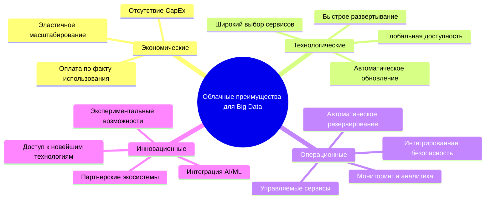

**Описание схемы 2: Преимущества облачных платформ для Big Data**
Интеллектуальная карта показывает четыре основные категории преимуществ облачных вычислений для обработки больших данных:

1. **Экономические преимущества**: 
   - Операционные расходы (OpEx) вместо капитальных (CapEx)
   - Плата только за фактически использованные ресурсы
   - Автоматическое масштабирование в зависимости от нагрузки

2. **Технологические преимущества**:
   - Доступ к сотням специализированных сервисов
   - Развертывание новых кластеров за минуты вместо месяцев
   - Автоматические обновления и патчи безопасности
   - Глобальная инфраструктура с низкой задержкой

3. **Операционные преимущества**:
   - Управляемые сервисы (managed services) снижают нагрузку на ИТ-команды
   - Встроенная отказоустойчивость и резервирование
   - Комплексные инструменты мониторинга и аналитики
   - Интегрированные средства безопасности и соответствия

4. **Инновационные преимущества**:
   - Быстрый доступ к новейшим технологиям (квантовые вычисления, нейросети)
   - Готовая интеграция с AI/ML сервисами
   - Возможность экспериментировать с минимальными затратами
   - Экосистемы партнерских решений

---

## 2. Архитектура облачных платформ для Big Data

### Общая архитектура Big Data в облаке

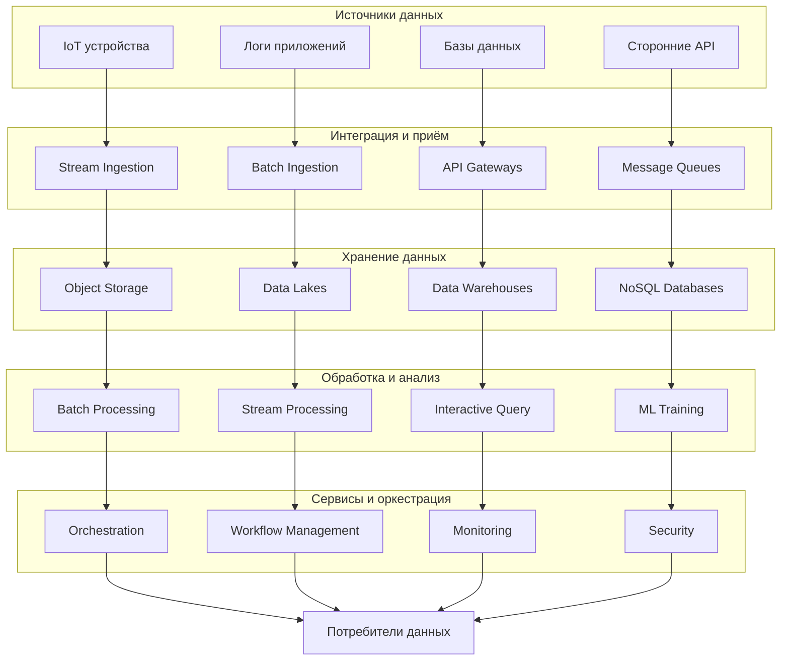

**Описание схемы 3: Общая архитектура Big Data в облаке**
Данная схема демонстрирует полный цикл обработки данных в облачной среде:

**Источники данных**:
- IoT устройства: датчики, сенсоры, умные устройства
- Логи приложений: журналы событий, ошибок, аудита
- Базы данных: реляционные, документные, графовые
- Сторонние API: внешние сервисы, партнерские системы

**Интеграция и приём**:
- Stream Ingestion: потоковый приём данных в реальном времени (Kafka, Kinesis)
- Batch Ingestion: пакетная загрузка данных (Sqoop, Data Transfer Service)
- API Gateways: управляемые точки входа для API-запросов
- Message Queues: очереди сообщений для асинхронной обработки

**Хранение данных**:
- Object Storage: неструктурированные данные (S3, Blob Storage)
- Data Lakes: сырые данные любого формата и структуры
- Data Warehouses: структурированные данные для аналитики
- NoSQL Databases: документные, ключ-значение, графовые БД

**Обработка и анализ**:
- Batch Processing: пакетная обработка (Spark, Hadoop)
- Stream Processing: потоковая обработка (Flink, Storm)
- Interactive Query: интерактивные запросы (Presto, Drill)
- ML Training: обучение моделей машинного обучения

**Сервисы и оркестрация**:
- Оркестрация: управление пайплайнами (Airflow, Step Functions)
- Workflow Management: управление рабочими процессами
- Monitoring: мониторинг производительности и доступности
- Security: управление доступом, шифрование, аудит

---

## 3. Сравнение облачных платформ: AWS, Azure, Google Cloud

### Архитектурные стеки трёх основных провайдеров

```mermaid
graph TD
    subgraph "AWS Big Data Stack"
        AWSS3[S3 - Object Storage]
        AWSGL[Glue - ETL]
        AWSEM[EMR - Hadoop/Spark]
        AWSRS[Redshift - Data Warehouse]
        AWSKS[Kinesis - Stream Processing]
        AWSQS[QuickSight - BI]
        AWSSG[SageMaker - ML]
        
        AWSS3 --> AWSGL --> AWSEM
        AWSKS --> AWSEM
        AWSEM --> AWSRS --> AWSQS
        AWSEM --> AWSSG
    end
    
    subgraph "Azure Big Data Stack"
        AZAD[ADLS - Data Lake Storage]
        AZDF[Data Factory - ETL]
        AZHD[HDInsight - Hadoop/Spark]
        AZSY[Synapse - Analytics]
        AZEV[Event Hubs - Streaming]
        AZPW[Power BI - Visualization]
        AZML[Azure ML - Machine Learning]
        
        AZAD --> AZDF --> AZHD
        AZEV --> AZHD
        AZHD --> AZSY --> AZPW
        AZHD --> AZML
    end
    
    subgraph "Google Cloud Big Data Stack"
        GCGS[Cloud Storage]
        GCDP[Dataflow - Stream/Batch]
        GCDP[Dataproc - Hadoop/Spark]
        GCGB[BigQuery - Data Warehouse]
        GCPB[Pub/Sub - Messaging]
        GCDS[Data Studio - BI]
        GCAI[Vertex AI - ML Platform]
        
        GCGS --> GCDP --> GCDP
        GCPB --> GCDP
        GCDP --> GCGB --> GCDS
        GCDP --> GCAI
    end
    
    style AWSS3 fill:#ff9900
    style AZAD fill:#0078d4
    style GCGS fill:#4285f4
```

**Описание схемы 4: Архитектурные стеки трёх основных провайдеров**
Схема сравнивает основные сервисы трёх лидирующих облачных платформ для Big Data:

**AWS (Amazon Web Services)** - наиболее зрелая и полная экосистема:
- S3: объектное хранилище, фактический стандарт отрасли
- Glue: управляемый ETL сервис с автоматическим обнаружением схем
- EMR: управляемые кластеры Hadoop и Spark
- Redshift: облачное хранилище данных с колоночным хранением
- Kinesis: потоковая обработка данных в реальном времени
- QuickSight: бизнес-аналитика и визуализация
- SageMaker: полный цикл машинного обучения

**Microsoft Azure** - сильная интеграция с корпоративным стеком Microsoft:
- ADLS: Azure Data Lake Storage для больших данных
- Data Factory: оркестрация и ETL пайплайнов
- HDInsight: управляемые сервисы Hadoop, Spark, HBase
- Synapse: объединение хранилища данных и аналитики Big Data
- Event Hubs: масштабируемый прием событий
- Power BI: ведущий инструмент бизнес-аналитики
- Azure ML: платформа машинного обучения

**Google Cloud Platform** - сильные позиции в аналитике и AI:
- Cloud Storage: объектное хранилище с многоуровневой структурой
- Dataflow: унифицированная потоковая и пакетная обработка
- Dataproc: управляемые сервисы Hadoop и Spark
- BigQuery: серверless хранилище данных с высокой производительностью
- Pub/Sub: глобальная система обмена сообщениями
- Data Studio: визуализация и отчетность
- Vertex AI: унифицированная платформа для ML

Каждая платформа имеет свою стратегию: AWS предлагает наибольшее количество сервисов, Azure фокусируется на интеграции с корпоративными решениями, Google Cloud выделяется в области аналитики и AI.

---

### Функциональное сравнение сервисов

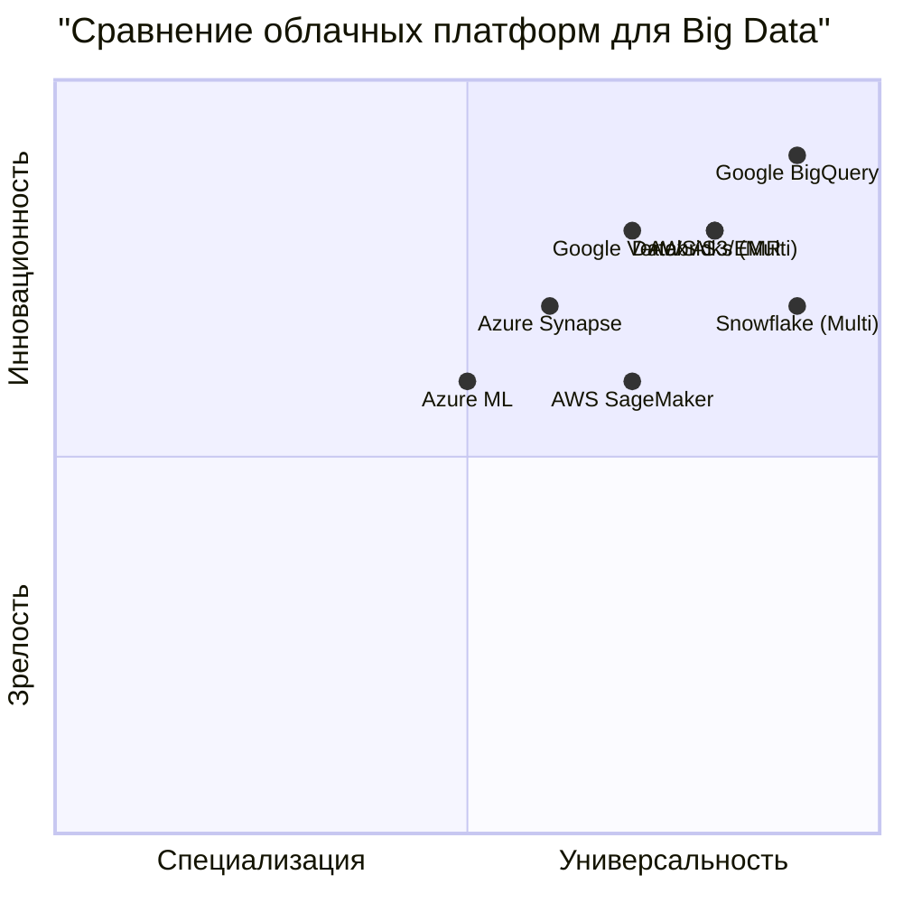

**Описание схемы 5: Функциональное сравнение сервисов**
Квадрантная диаграмма позиционирует ключевые сервисы облачных платформ по двум осям:

**Ось X: Специализация ↔ Универсальность**
- Левые квадранты: специализированные решения для конкретных задач
- Правые квадранты: универсальные платформы широкого профиля

**Ось Y: Зрелость ↔ Инновационность**
- Верхние квадранты: зрелые, проверенные временем решения
- Нижние квадранты: инновационные, новые технологии

**Позиционирование сервисов**:
1. **AWS S3/EMR** [0.8, 0.8] - Высокая зрелость и универсальность. Доказанная надежность и широкий спектр применения.
2. **AWS SageMaker** [0.7, 0.6] - Зрелое ML-решение с хорошим балансом специализации и универсальности.
3. **Azure Synapse** [0.6, 0.7] - Инновационное решение, объединяющее хранилище данных и аналитику Big Data.
4. **Azure ML** [0.5, 0.6] - Более специализированное решение по сравнению с конкурентами.
5. **Google BigQuery** [0.9, 0.9] - Лидер в обоих измерениях: наиболее зрелое и инновационное решение для аналитики.
6. **Google Vertex AI** [0.7, 0.8] - Инновационная унифицированная платформа AI.
7. **Databricks** [0.8, 0.8] - Кроссплатформенное решение с высокой зрелостью и универсальностью.
8. **Snowflake** [0.9, 0.7] - Специализированное, но очень зрелое решение для хранилищ данных.

Диаграмма помогает выбрать платформу в зависимости от потребностей: для зрелых enterprise-решений - AWS, для инновационной аналитики - Google Cloud, для интеграции с Microsoft экосистемой - Azure.

---

## 4. Контейнеризация в Big Data: Docker и Kubernetes

### Архитектура контейнеризированного Big Data приложения

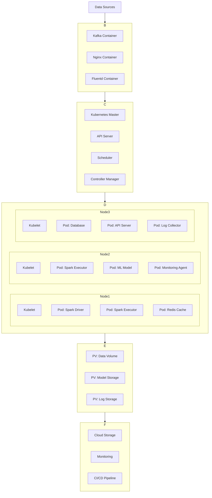

**Описание схемы 6: Архитектура контейнеризированного Big Data приложения**
Схема показывает полную архитектуру контейнеризированного приложения для обработки больших данных:

**Data Sources** - различные источники данных (базы данных, потоки, файлы).

**Ingestion Layer (Слой приёма данных)**:
- Kafka Container: распределенная система потоковой обработки сообщений
- Nginx Container: веб-сервер для приёма HTTP-запросов
- Fluentd Container: сбор и агрегация логов

**Orchestration Layer (Слой оркестрации) - Kubernetes Master**:
- API Server: основной интерфейс управления кластером
- Scheduler: распределение подов (pods) по нодам
- Controller Manager: отслеживание состояния кластера

**Worker Nodes (Рабочие ноды)** - три ноды с разными наборами подов:
- Node1: Spark Driver (управление заданиями), Spark Executor (выполнение задач), Redis Cache (кэширование)
- Node2: Дополнительные Spark Executor, ML Model (обслуживание моделей), Monitoring Agent
- Node3: Database (база данных), API Server (предоставление данных), Log Collector (сбор логов)

**Persistent Storage (Постоянное хранилище)**:
- PV: Data Volume - том для хранения данных
- PV: Model Storage - том для хранения ML-моделей
- PV: Log Storage - том для логов

**External Services (Внешние сервисы)**:
- Cloud Storage: объектное хранилище в облаке
- Monitoring: системы мониторинга (Prometheus, Grafana)
- CI/CD Pipeline: конвейер непрерывной интеграции и доставки

Данная архитектура демонстрирует преимущества контейнеризации: изоляция зависимостей, портативность, эффективное использование ресурсов и масштабируемость.

---

### Kubernetes для распределенной обработки данных

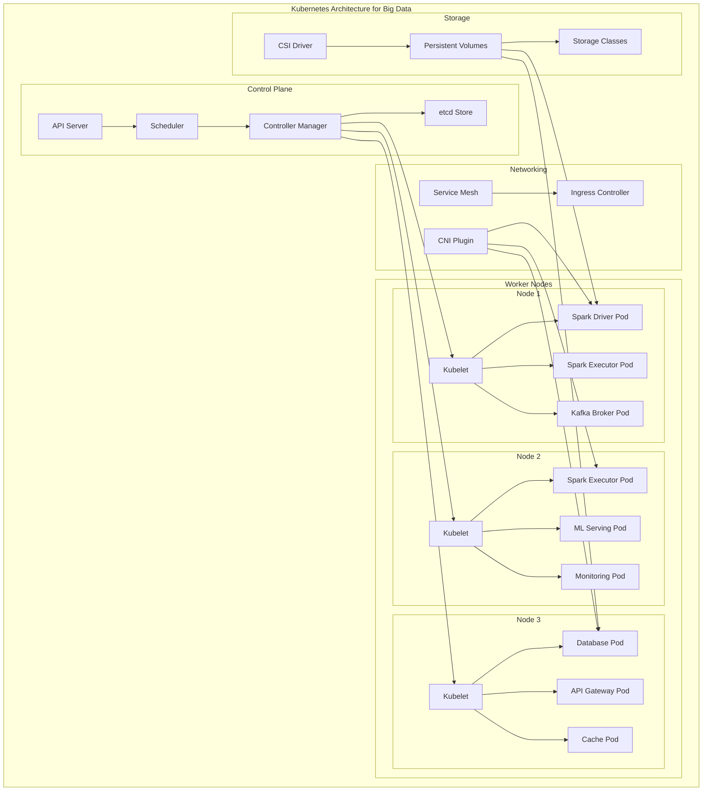

**Описание схемы 7: Kubernetes для распределенной обработки данных**
Детализированная архитектура Kubernetes кластера для Big Data workloads:

**Control Plane (Плоскость управления)**:
- API Server: точка входа для всех команд управления (kubectl, UI, API)
- Scheduler: принимает решение, на какой ноде запускать под
- Controller Manager: следит за состоянием кластера, восстанавливает поды при сбоях
- etcd Store: распределенное key-value хранилище состояния кластера

**Worker Nodes (Рабочие ноды)** - три физические или виртуальные машины:
- Node 1: Spark Driver (координатор Spark), Spark Executor (исполнитель), Kafka Broker (брокер сообщений)
- Node 2: Spark Executor, ML Serving Pod (обслуживание ML-моделей), Monitoring Pod (мониторинг)
- Node 3: Database Pod (база данных), API Gateway Pod (шлюз API), Cache Pod (кэш)

Каждой нодой управляет Kubelet - агент, который получает команды от Control Plane.

**Networking (Сеть)**:
- CNI Plugin: Container Network Interface обеспечивает сетевое взаимодействие подов
- Service Mesh: управление трафиком между сервисами (Istio, Linkerd)
- Ingress Controller: управление входящим трафиком извне кластера

**Storage (Хранилище)**:
- CSI Driver: Container Storage Interface для подключения внешних хранилищ
- Persistent Volumes: постоянные тома данных
- Storage Classes: классы хранилищ с разными характеристиками (SSD, HDD, performance)

Эта архитектура позволяет эффективно оркестрировать распределенные Big Data workloads с автоматическим масштабированием, самовосстановлением и управлением ресурсами.

---

### Преимущества контейнеризации для Big Data

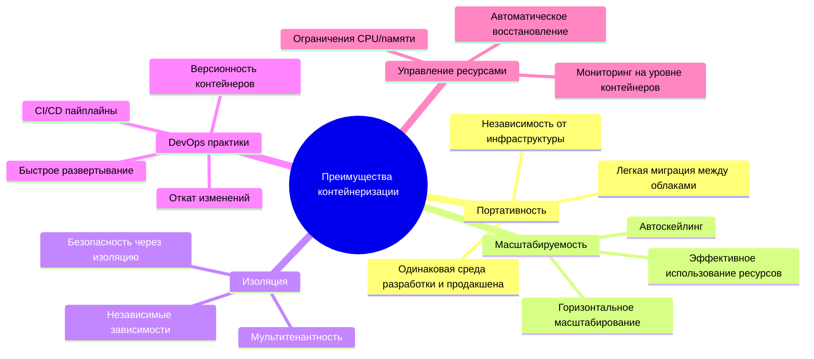

**Описание схемы 8: Преимущества контейнеризации для Big Data**
Интеллектуальная карта показывает пять ключевых категорий преимуществ контейнеризации:

1. **Портативность**:
   - Единая среда от разработки до продакшена ("works on my machine" больше не проблема)
   - Абстракция от инфраструктуры: один и тот же контейнер работает на любом хосте с Docker
   - Легкая миграция между облачными провайдерами и локальными средами

2. **Масштабируемость**:
   - Горизонтальное масштабирование: добавление новых экземпляров вместо увеличения мощности существующих
   - Автоматическое масштабирование на основе метрик (CPU, память, custom metrics)
   - Более эффективное использование ресурсов за счет изоляции и ограничений

3. **Изоляция**:
   - Независимые зависимости: разные версии библиотек для разных сервисов
   - Повышенная безопасность: изоляция процессов и файловых систем
   - Мультитенантность: безопасный запуск разных приложений на одном хосте

4. **DevOps практики**:
   - Непрерывная интеграция и доставка (CI/CD): автоматизированные пайплайны сборки и развертывания
   - Версионность: тегирование образов для управления версиями
   - Быстрое развертывание: секунды вместо минут/часов
   - Простой откат: возврат к предыдущей версии образа

5. **Управление ресурсами**:
   - Точные ограничения CPU и памяти для каждого контейнера
   - Детальный мониторинг на уровне контейнеров
   - Автоматическое восстановление при сбоях (restart policies, health checks)

Для Big Data workloads контейнеризация особенно важна из-за сложности зависимостей (разные версии Hadoop, Spark, Python библиотек) и необходимости изоляции вычислительно интенсивных задач.

---

## 5. Data-as-a-Service (DaaS) архитектура

### Современная DaaS платформа

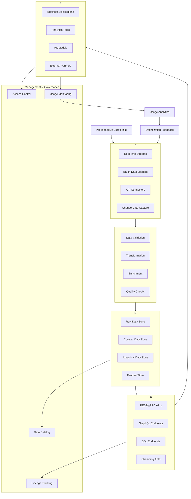

**Описание схемы 9: Современная DaaS платформа**
Архитектура Data-as-a-Service платформы, превращающей данные в сервис:

**Data Ingestion Layer (Слой приёма данных)**:
- Real-time Streams: потоковые данные (Kafka, Kinesis)
- Batch Data Loaders: пакетная загрузка (ETL, ELT)
- API Connectors: подключение к внешним API
- Change Data Capture: отслеживание изменений в источниках

**Data Processing Pipeline (Конвейер обработки)**:
- Data Validation: проверка качества и целостности
- Transformation: преобразование форматов и структур
- Enrichment: обогащение данных дополнительной информацией
- Quality Checks: контроль качества на каждом этапе

**Data Storage Layer (Слой хранения)** - зональная архитектура:
- Raw Data Zone: сырые, неизмененные данные
- Curated Data Zone: очищенные и подготовленные данные
- Analytical Data Zone: данные, оптимизированные для анализа
- Feature Store: хранилище признаков для ML

**Data Service Layer (Сервисный слой)** - различные интерфейсы доступа:
- REST/gRPC APIs: стандартные API для программирования
- GraphQL Endpoints: гибкие запросы для клиентов
- SQL Endpoints: доступ через SQL для аналитиков
- Streaming APIs: потоковая передача данных

**Data Consumption (Потребление данных)**:
- Business Applications: корпоративные приложения
- Analytics Tools: BI и аналитические системы
- ML Models: машинное обучение и AI
- External Partners: интеграция с партнерами

**Management & Governance (Управление и governance)**:
- Data Catalog: каталог метаданных и поиск
- Lineage Tracking: отслеживание происхождения данных
- Access Control: управление доступом и правами
- Usage Monitoring: мониторинг использования данных

**Feedback Loop (Обратная связь)**:
- Usage Analytics: анализ использования сервисов
- Optimization Feedback: автоматическая оптимизация на основе использования

DaaS трансформирует данные из пассивного актива в активный сервис, предоставляемый по запросу с гарантиями качества, безопасности и производительности.

---

### Компоненты современной DaaS платформы

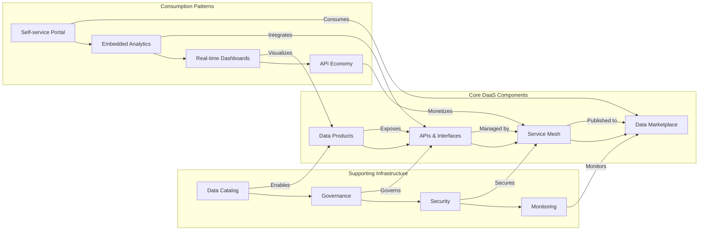

**Описание схемы 10: Компоненты современной DaaS платформы**
Схема показывает взаимосвязи между основными компонентами DaaS платформы:

**Core DaaS Components (Основные компоненты)**:
1. **Data Products** - упакованные наборы данных с документацией, SLA и контрактами
2. **APIs & Interfaces** - различные способы доступа к данным (REST, GraphQL, SQL)
3. **Service Mesh** - управление взаимодействием между сервисами (трафик, безопасность, наблюдаемость)
4. **Data Marketplace** - каталог доступных продуктов данных для самообслуживания

**Supporting Infrastructure (Поддерживающая инфраструктура)**:
1. **Data Catalog** - инвентаризация и поиск данных
2. **Governance** - политики, стандарты, управление жизненным циклом
3. **Security** - аутентификация, авторизация, шифрование, маскирование
4. **Monitoring** - отслеживание использования, производительности, качества

**Consumption Patterns (Паттерны потребления)**:
1. **Self-service Portal** - веб-интерфейс для поиска и доступа к данным
2. **Embedded Analytics** - встраивание аналитики в бизнес-приложения
3. **Real-time Dashboards** - визуализация данных в реальном времени
4. **API Economy** - монетизация данных через API для внешних потребителей

**Ключевые взаимосвязи**:
- Data Products предоставляются через APIs, которые управляются Service Mesh и публикуются в Data Marketplace
- Data Catalog делает возможным создание Data Products, Governance управляет APIs, Security защищает Service Mesh, Monitoring отслеживает Marketplace
- Потребители используют Self-service Portal для доступа к Marketplace, Embedded Analytics интегрирует APIs, Dashboards визуализируют Data Products, а API Economy монетизирует Service Mesh

Эта архитектура позволяет создавать экосистему данных, где данные легко обнаруживаемы, доступны и потребляемы различными способами.

---

## 6. Serverless архитектуры для Big Data

### Serverless Big Data Pipeline

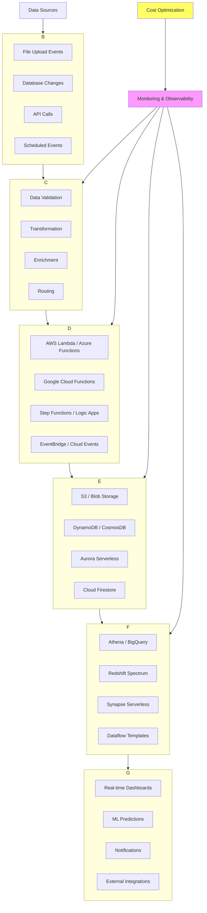

**Описание схемы 11: Serverless Big Data Pipeline**
Полностью бессерверный пайплайн обработки данных, не требующий управления инфраструктурой:

**Event-Driven Triggers (Событийные триггеры)**:
- File Upload Events: загрузка файлов в облачное хранилище
- Database Changes: изменения в базе данных (CDC)
- API Calls: вызовы API для инициирования обработки
- Scheduled Events: регулярные запуски по расписанию (cron)

**Serverless Functions (Бессерверные функции)** - микрозадачи:
- Data Validation: проверка формата и качества
- Transformation: преобразование данных
- Enrichment: дополнение данных из внешних источников
- Routing: маршрутизация данных в нужные хранилища

**Serverless Processing (Бессерверная обработка)** - облачные реализации:
- AWS Lambda / Azure Functions / Google Cloud Functions: execution environments
- Step Functions / Logic Apps: оркестрация workflow
- EventBridge / Cloud Events: управление событиями

**Serverless Storage (Бессерверное хранилище)** - полностью управляемые хранилища:
- S3 / Blob Storage: объектные хранилища
- DynamoDB / CosmosDB: NoSQL базы данных
- Aurora Serverless: реляционная БД с автоскейлингом
- Cloud Firestore: документная БД

**Serverless Analytics (Бессерверная аналитика)**:
- Athena / BigQuery: SQL-запросы к данным в хранилище
- Redshift Spectrum: запросы к данным в S3
- Synapse Serverless: бессерверный пул запросов
- Dataflow Templates: шаблоны обработки данных

**Results & Actions (Результаты и действия)**:
- Real-time Dashboards: обновляемые в реальном времени дашборды
- ML Predictions: прогнозы машинного обучения
- Notifications: оповещения (email, SMS, push)
- External Integrations: интеграция с внешними системами

**Управление и оптимизация**:
- Monitoring & Observability: централизованный мониторинг всех компонентов
- Cost Optimization: оптимизация затрат на основе использования

Ключевое преимущество: полное отсутствие управления инфраструктурой, автоматическое масштабирование от 0 до миллионов запросов, оплата только за фактическое использование.

---

### Преимущества Serverless для Big Data

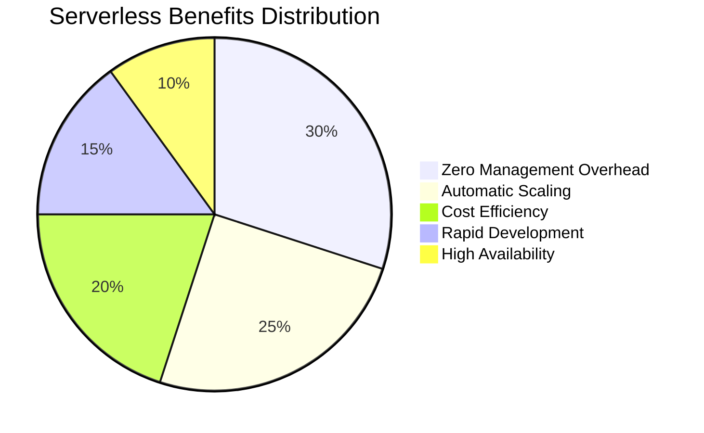

**Описание схемы 12: Преимущества Serverless для Big Data**
Круговая диаграмма показывает распределение ключевых преимуществ serverless архитектур:

1. **Zero Management Overhead (30%)** - Наибольшее преимущество:
   - Нет необходимости управлять серверами, операционными системами, патчами
   - Автоматическое резервирование и отказоустойчивость
   - Встроенное логирование и мониторинг
   - Для Big Data это означает фокус на логике обработки, а не на инфраструктуре

2. **Automatic Scaling (25%)**:
   - Мгновенное масштабирование от 0 до тысяч параллельных исполнений
   - Обработка пиковых нагрузок без предварительного планирования
   - Для пакетной обработки Big Data: автоматическое распределение задач

3. **Cost Efficiency (20%)**:
   - Оплата только за время выполнения (миллисекунды)
   - Нет платы за простой (idle time)
   - Для периодических Big Data задач значительная экономия

4. **Rapid Development (15%)**:
   - Быстрое развертывание и итерации
   - Интеграция с CI/CD пайплайнами
   - Для аналитики данных: быстрое прототипирование и тестирование гипотез

5. **High Availability (10%)**:
   - Встроенная отказоустойчивость и multi-AZ развертывание
   - Автоматическое восстановление при сбоях
   - Для критичных данных: гарантированная доступность

Для Big Data workloads serverless особенно выгоден для:
- Периодических ETL-задач (ежедневные/еженедельные загрузки)
- Обработки потоковых данных с переменной нагрузкой
- Экспериментов и прототипирования аналитических моделей
- Интеграции различных источников данных

---

## 7. Мульти-облачные стратегии и гибридные архитектуры

### Современная мульти-облачная архитектура

```mermaid
graph TB
    subgraph "AWS Cloud"
        A1[S3 Data Lake]
        A2[Redshift]
        A3[SageMaker]
        A4[Lambda Functions]
    end
    
    subgraph "Azure Cloud"
        B1[Azure Data Lake]
        B2[Synapse Analytics]
        B3[Azure ML]
        B4[Functions]
    end
    
    subgraph "Google Cloud"
        C1[Cloud Storage]
        C2[BigQuery]
        C3[Vertex AI]
        C4[Cloud Functions]
    end
    
    subgraph "On-Premises Infrastructure"
        D1[Legacy Systems]
        D2[Sensitive Data]
        D3[Real-time Processing]
        D4[Edge Devices]
    end
    
    subgraph "Orchestration & Management"
        E1[Kubernetes Federation]
        E2[Terraform/Crossplane]
        E3[Service Mesh]
        E4[Monitoring Platform]
    end
    
    subgraph "Data Plane"
        F1[Data Replication]
        F2[Data Sync Services]
        F3[Global Load Balancer]
        F4[CDN Network]
    end
    
    subgraph "Control Plane"
        G1[Policy Management]
        G2[Security Governance]
        G3[Cost Optimization]
        G4[Compliance Engine]
    end
    
    A1 -- "Data Sync" --> F2
    B1 -- "Data Sync" --> F2
    C1 -- "Data Sync" --> F2
    D1 -- "Secure Tunnel" --> F2
    
    E1 --> A4
    E1 --> B4
    E1 --> C4
    
    F3 --> A1
    F3 --> B1
    F3 --> C1
    
    G2 --> A1
    G2 --> B1
    G2 --> C1
    G2 --> D1
    
    G3 --> E4
```

**Описание схемы 13: Современная мульти-облачная архитектура**
Архитектура, использующая несколько облачных провайдеров одновременно:

**Облачные окружения**:
1. **AWS Cloud**: S3 Data Lake (хранилище), Redshift (аналитика), SageMaker (ML), Lambda (серверные функции)
2. **Azure Cloud**: Azure Data Lake, Synapse Analytics, Azure ML, Functions
3. **Google Cloud**: Cloud Storage, BigQuery, Vertex AI, Cloud Functions
4. **On-Premises**: Устаревшие системы, чувствительные данные, обработка в реальном времени, edge устройства

**Оркестрация и управление**:
- Kubernetes Federation: управление кластерами в разных облаках
- Terraform/Crossplane: инфраструктура как код для мульти-облака
- Service Mesh: единая сеть сервисов поверх разных облаков
- Monitoring Platform: централизованный мониторинг всей инфраструктуры

**Data Plane (Плоскость данных)**:
- Data Replication: репликация данных между облаками
- Data Sync Services: синхронизация данных в реальном времени
- Global Load Balancer: распределение нагрузки между облаками
- CDN Network: контентная сеть доставки

**Control Plane (Плоскость управления)**:
- Policy Management: единые политики для всех облаков
- Security Governance: централизованное управление безопасностью
- Cost Optimization: оптимизация затрат между провайдерами
- Compliance Engine: обеспечение соответствия требованиям

**Ключевые взаимосвязи**:
- Данные синхронизируются между всеми облаками через Data Sync Services
- Kubernetes Federation управляет серверными функциями во всех облаках
- Global Load Balancer распределяет трафик оптимальным образом
- Security Governance обеспечивает единый уровень безопасности

Преимущества мульти-облачной стратегии:
- Избегание vendor lock-in
- Использование лучших сервисов каждого провайдера
- Географическая избыточность и отказоустойчивость
- Переговоры о лучших условиях с провайдерами

---

### Стратегии распределения рабочих нагрузок

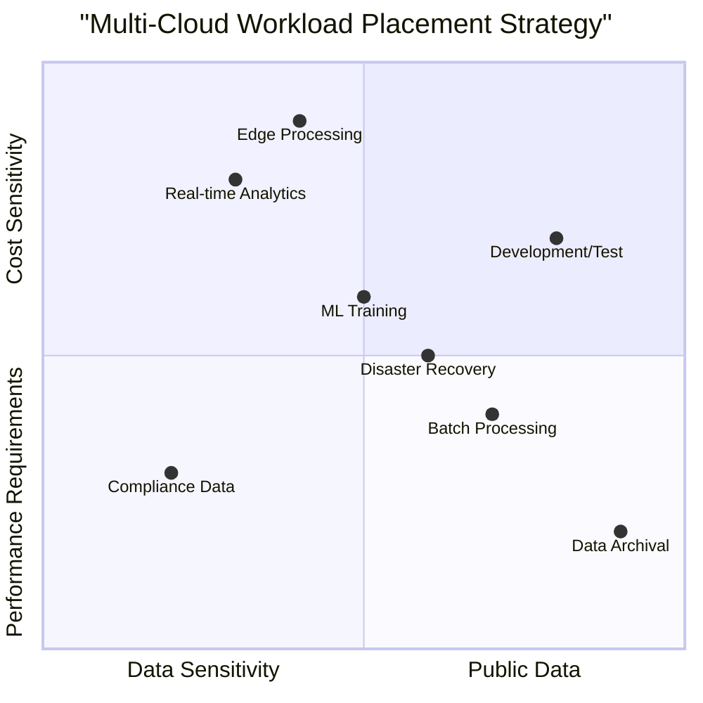

**Описание схемы 14: Стратегии распределения рабочих нагрузок**
Квадрантная диаграмма помогает определить оптимальное размещение рабочих нагрузок в мульти-облачной среде:

**Ось X: Data Sensitivity (Чувствительность данных)**:
- Левые квадранты: Высокая чувствительность (персональные данные, коммерческая тайна)
- Правые квадранты: Низкая чувствительность (публичные данные, агрегированная статистика)

**Ось Y: Performance Requirements (Требования к производительности)**:
- Верхние квадранты: Высокие требования (низкая задержка, высокая пропускная способность)
- Нижние квадранты: Низкие требования (можно пожертвовать производительностью ради стоимости)

**Размещение рабочих нагрузок**:

1. **Real-time Analytics [0.3, 0.8]**:
   - Чувствительные данные с высокими требованиями к производительности
   - Размещение: Основное облако с лучшими performance SLA, возможно с выделенными инстансами

2. **Batch Processing [0.7, 0.4]**:
   - Менее чувствительные данные, можно пожертвовать скоростью ради стоимости
   - Размещение: Облако с самыми дешевыми вычислительными ресурсами, spot instances

3. **ML Training [0.5, 0.6]**:
   - Умеренная чувствительность, высокие требования к GPU/TPU
   - Размещение: Облако с лучшими предложениями по AI/ML ускорителям

4. **Data Archival [0.9, 0.2]**:
   - Чувствительные данные, но очень низкие требования к доступу
   - Размещение: Холодное хранилище в наиболее безопасном и дешевом облаке

5. **Compliance Data [0.2, 0.3]**:
   - Высокая чувствительность, можно пожертвовать производительностью
   - Размещение: Локальный дата-центр или специализированное облако с сертификатами соответствия

6. **Edge Processing [0.4, 0.9]**:
   - Умеренная чувствительность, самые высокие требования к задержке
   - Размещение: Edge computing платформы, CDN, близко к пользователям

7. **Development/Test [0.8, 0.7]**:
   - Низкая чувствительность (тестовые данные), умеренные требования
   - Размещение: Самое дешевое облако для разработки, возможно с автоматическим shutdown

8. **Disaster Recovery [0.6, 0.5]**:
   - Умеренная чувствительность, требования к скорости восстановления
   - Размещение: Вторичное облако у другого провайдера для географической избыточности

Эта стратегия позволяет оптимизировать затраты, производительность и безопасность, размещая каждую рабочую нагрузку в наиболее подходящем окружении.

---

## 8. Будущие тенденции и перспективы

### Эволюция облачных технологий для Big Data

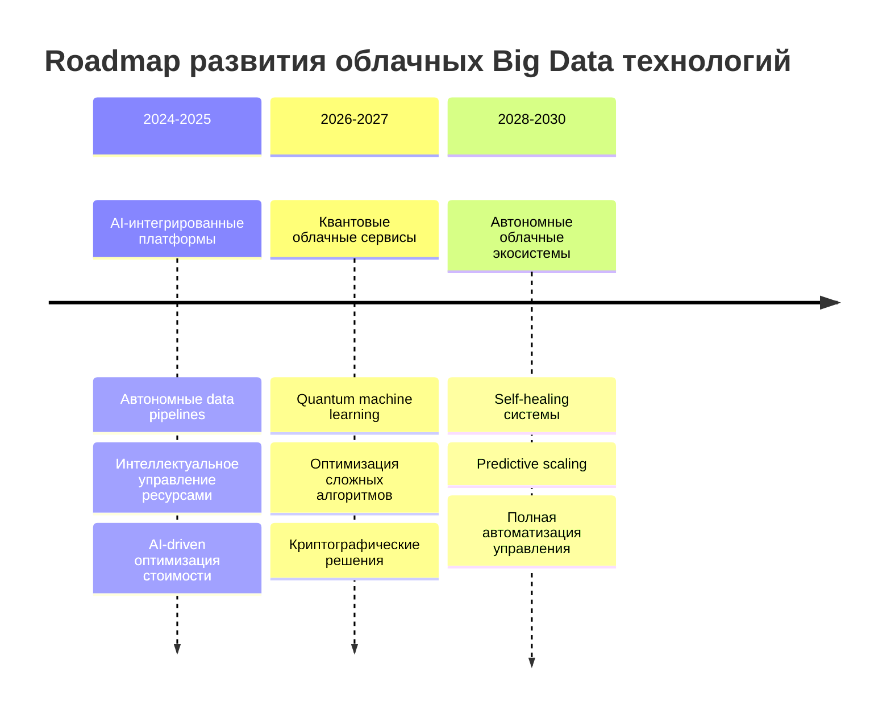

**Описание схемы 15: Эволюция облачных технологий для Big Data**
Дорожная карта развития облачных технологий для обработки больших данных:

**2024-2025: AI-интегрированные платформы**
- **Автономные data pipelines**: AI будет самостоятельно проектировать, оптимизировать и поддерживать конвейеры данных, предсказывая и предотвращая проблемы
- **Интеллектуальное управление ресурсами**: ML алгоритмы будут динамически распределять ресурсы, предсказывая пиковые нагрузки и оптимизируя использование
- **AI-driven оптимизация стоимости**: Системы будут автоматически выбирать наиболее cost-effective конфигурации и типы инстансов

**2026-2027: Квантовые облачные сервисы**
- **Quantum machine learning**: Использование квантовых алгоритмов для ускорения обучения моделей на больших данных
- **Оптимизация сложных алгоритмов**: Решение задач оптимизации маршрутов, расписаний, цепочек поставок с помощью квантовых вычислений
- **Криптографические решения**: Квантово-устойчивые алгоритмы шифрования для защиты данных

**2028-2030: Автономные облачные экосистемы**
- **Self-healing системы**: Полностью автономные системы, способные самостоятельно диагностировать и исправлять проблемы без вмешательства человека
- **Predictive scaling**: Предсказательное масштабирование на основе анализа исторических данных, бизнес-циклов и внешних факторов
- **Полная автоматизация управления**: Искусственный интеллект заменит cloud engineers в рутинных операциях управления инфраструктурой

Эта эволюция приведет к переходу от "облака как платформы" к "облаку как партнеру", где системы будут не просто выполнять команды, а предлагать оптимальные решения и самостоятельно их реализовывать.

---

### Критические вызовы и решения

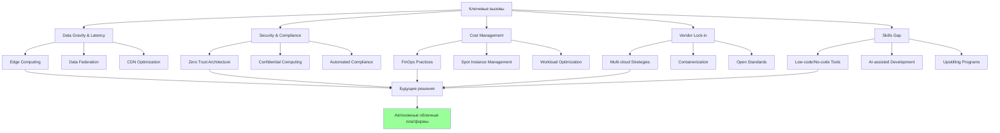

**Описание схемы 16: Критические вызовы и решения**
Схема показывает основные вызовы облачных Big Data и пути их решения:

**Ключевые вызовы**:
1. **Data Gravity & Latency**: Большие объемы данных создают "гравитацию", затрудняя перемещение, и увеличивают задержки
2. **Security & Compliance**: Защита данных и соответствие регуляторным требованиям (GDPR, HIPAA, PCI DSS)
3. **Cost Management**: Непредсказуемые и быстро растущие затраты на облачные сервисы
4. **Vendor Lock-in**: Зависимость от конкретного облачного провайдера и его сервисов
5. **Skills Gap**: Нехватка специалистов с необходимыми навыками работы с облачными Big Data технологиями

**Решения для каждого вызова**:

**Для Data Gravity & Latency**:
- Edge Computing: Обработка данных ближе к источнику
- Data Federation: Единый доступ к данным без физического перемещения
- CDN Optimization: Использование сетей доставки контента

**Для Security & Compliance**:
- Zero Trust Architecture: "Никому не доверяй, проверяй всё"
- Confidential Computing: Шифрование данных во время обработки
- Automated Compliance: Автоматическая проверка соответствия требованиям

**Для Cost Management**:
- FinOps Practices: Культура финансовой ответственности в облаке
- Spot Instance Management: Использование прерываемых инстансов
- Workload Optimization: Оптимизация рабочих нагрузок

**Для Vendor Lock-in**:
- Multi-cloud Strategies: Использование нескольких провайдеров
- Containerization: Контейнеризация приложений для портативности
- Open Standards: Использование открытых стандартов и API

**Для Skills Gap**:
- Low-code/No-code Tools: Инструменты с минимальным программированием
- AI-assisted Development: ИИ-помощники для разработки
- Upskilling Programs: Программы обучения и переподготовки

**Будущие решения**: Комбинация этих подходов ведет к созданию автономных облачных платформ, которые будут самостоятельно решать эти вызовы с минимальным вмешательством человека.

---

## Заключение и ключевые выводы

### Сводная матрица выбора технологий

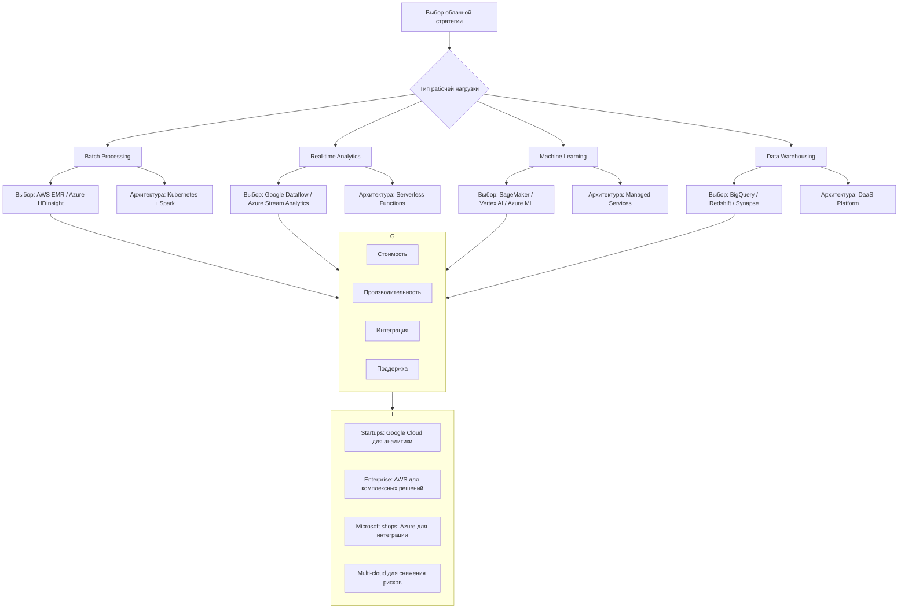

**Описание схемы 17: Сводная матрица выбора технологий**
Диаграмма принятия решений для выбора облачной стратегии:

**Шаг 1: Определение типа рабочей нагрузки**:
1. **Batch Processing** (Пакетная обработка): Обработка больших объемов данных периодически
   - Выбор технологии: AWS EMR или Azure HDInsight
   - Рекомендуемая архитектура: Kubernetes + Spark для оркестрации и обработки

2. **Real-time Analytics** (Аналитика в реальном времени): Непрерывная обработка потоковых данных
   - Выбор технологии: Google Dataflow или Azure Stream Analytics
   - Рекомендуемая архитектура: Serverless Functions для эластичности

3. **Machine Learning** (Машинное обучение): Обучение и обслуживание ML моделей
   - Выбор технологии: SageMaker (AWS), Vertex AI (Google), Azure ML
   - Рекомендуемая архитектура: Managed Services для минимизации операционных затрат

4. **Data Warehousing** (Хранилища данных): Аналитика и отчетность
   - Выбор технологии: BigQuery (Google), Redshift (AWS), Synapse (Azure)
   - Рекомендуемая архитектура: Data-as-a-Service Platform

**Шаг 2: Критерии выбора**:
- **Стоимость**: Total Cost of Ownership (TCO), модели ценообразования
- **Производительность**: SLA, скорость обработки, latency
- **Интеграция**: Совместимость с существующей инфраструктурой
- **Поддержка**: Документация, сообщество, техническая поддержка

**Шаг 3: Рекомендации**:
- **Startups**: Google Cloud для аналитики (BigQuery, Dataflow)
- **Enterprise**: AWS для комплексных решений (широта сервисов, зрелость)
- **Microsoft shops**: Azure для интеграции с Office 365, Active Directory
- **Multi-cloud**: Для снижения рисков и использования лучших сервисов каждого провайдера

Эта матрица помогает принимать обоснованные решения при выборе облачных технологий для Big Data.

---

### Итоговые рекомендации

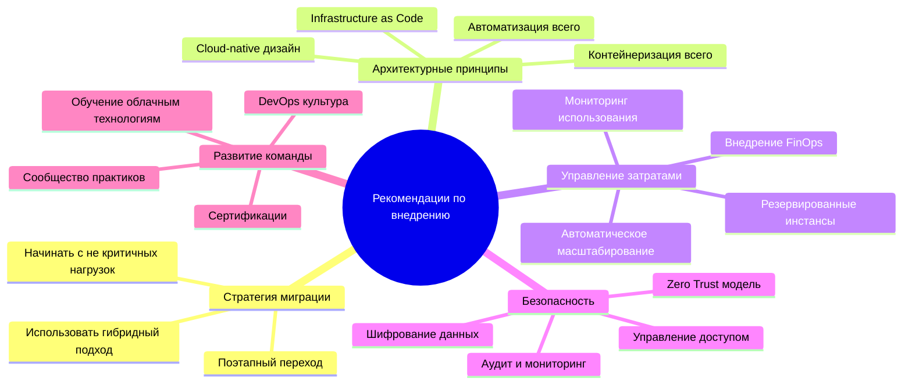

**Описание схемы 18: Итоговые рекомендации**
Интеллектуальная карта с ключевыми рекомендациями по внедрению облачных технологий для Big Data:

**1. Стратегия миграции**:
- **Начинать с не критичных нагрузок**: Тестовые среды, разработка, аналитика
- **Использовать гибридный подход**: Постепенная миграция, а не big bang
- **Поэтапный переход**: От простого к сложному, итеративный подход

**2. Архитектурные принципы**:
- **Cloud-native дизайн**: Проектировать для облака с нуля, а не лифтовать существующие приложения
- **Контейнеризация всего**: Docker и Kubernetes как стандарт
- **Infrastructure as Code**: Terraform, CloudFormation, ARM Templates
- **Автоматизация всего**: CI/CD, автоматическое тестирование, развертывание

**3. Управление затратами**:
- **Внедрение FinOps**: Культура финансовой ответственности за облачные расходы
- **Мониторинг использования**: CloudWatch, Azure Monitor, Stackdriver
- **Автоматическое масштабирование**: Auto Scaling Groups, Kubernetes HPA
- **Резервированные инстансы**: Планирование долгосрочных рабочих нагрузок

**4. Безопасность**:
- **Zero Trust модель**: "Никому не доверяй, проверяй всё"
- **Шифрование данных**: At rest, in transit, in use
- **Управление доступом**: IAM, RBAC, принцип наименьших привилегий
- **Аудит и мониторинг**: CloudTrail, Azure Policy, Security Command Center

**5. Развитие команды**:
- **Обучение облачным технологиям**: AWS/Azure/GCP сертификации
- **DevOps культура**: Разрушение барьеров между разработкой и эксплуатацией
- **Сертификации**: Подтверждение компетенций команды
- **Сообщество практиков**: Обмен знаниями внутри организации

**Ключевые выводы лекции**:
1. Облачные платформы обеспечивают беспрецедентную масштабируемость и экономическую эффективность для Big Data
2. Контейнеризация и Kubernetes стали стандартом де-факто для оркестрации распределенных рабочих нагрузок
3. Serverless архитектуры радикально снижают операционные издержки и ускоряют разработку
4. Data-as-a-Service модели трансформируют данные из пассивного актива в стратегический сервис предприятия
5. Мульти-облачные стратегии обеспечивают гибкость, снижают риски vendor lock-in и позволяют использовать лучшие сервисы каждого провайдера
6. Будущее за AI-интегрированными автономными облачными платформами, которые будут самостоятельно оптимизировать работу с данными

Успешное внедрение облачных технологий для Big Data требует не только технических решений, но и организационных изменений, развития компетенций команды и построения культуры data-driven принятия решений.