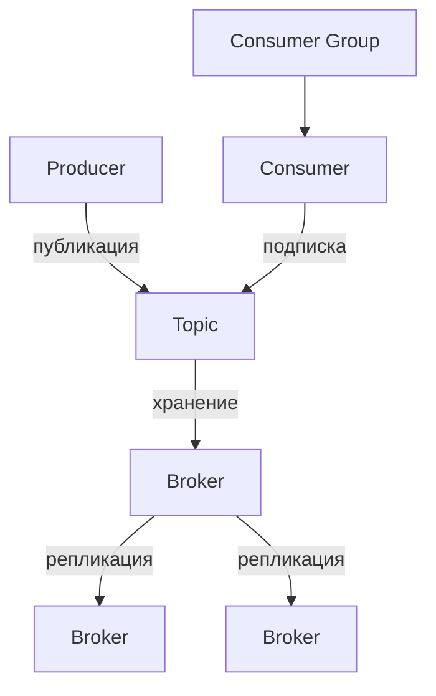
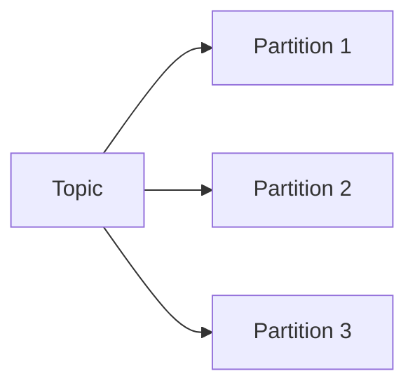
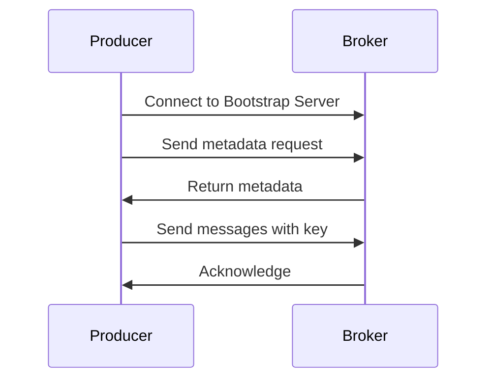
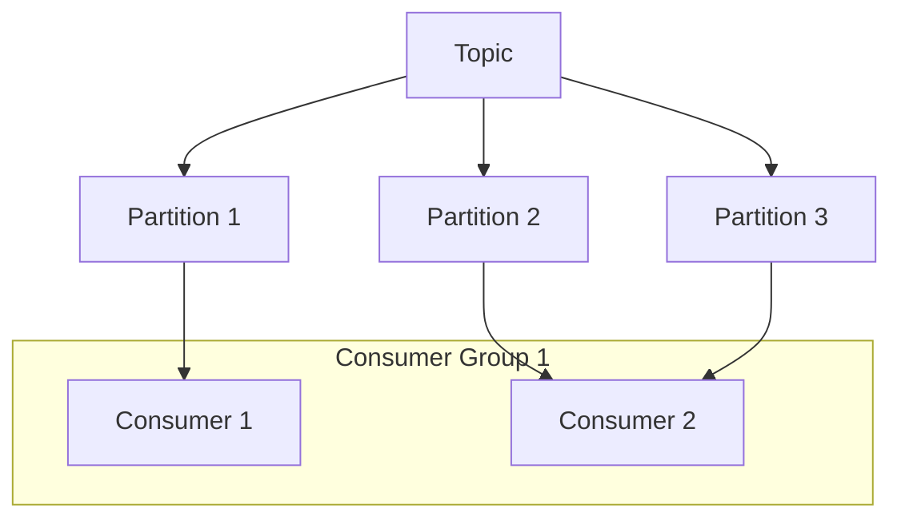

# Apache Kafka

## Оглавление
1. [Введение](#введение)
2. [Архитектура Kafka](#архитектура-kafka)
3. [Основные компоненты](#основные-компоненты)
4. [Производители и потребители](#производители-и-потребители)
5. [Пример работы](#пример-работы)
6. [Преимущества и use cases](#преимущества-и-use-cases)

---

## Введение

**Apache Kafka** — распределенная потоковая платформа для обработки событий в реальном времени. Разработана LinkedIn, сейчас поддерживается Apache Foundation.

### Ключевые возможности:
- Высокая пропускная способность
- Масштабируемость
- Отказоустойчивость
- Поддержка потоковой обработки

---

## Архитектура Kafka



---

## Основные компоненты

### 1. Topic (Топик)
Логический канал для сообщений. Сообщения категоризируются по топикам.



### 2. Partition (Партиция)
Упорядоченная последовательность сообщений в топике. Каждое сообщение имеет offset.

### 3. Broker (Брокер)
Сервер Kafka, хранящий данные. Кластер состоит из нескольких брокеров.

### 4. Producer/Consumer
- **Producer**: Отправляет сообщения в топики
- **Consumer**: Читает сообщения из топиков

### 5. ZooKeeper
Координирует работу брокеров и хранит метаданные кластера.

---

## Производители и потребители

### Producer Workflow


### Consumer Groups


---

## Пример работы

### 1. Создание топика
```bash
bin/kafka-topics.sh --create \
--topic orders \
--bootstrap-server localhost:9092 \
--partitions 3 \
--replication-factor 2
```

### 2. Отправка сообщения
```java
Properties props = new Properties();
props.put("bootstrap.servers", "localhost:9092");
props.put("key.serializer", StringSerializer.class);
props.put("value.serializer", StringSerializer.class);

Producer<String, String> producer = new KafkaProducer<>(props);
producer.send(new ProducerRecord<>("orders", "order123", "New order"));
```

### 3. Чтение сообщения
```java
Consumer<String, String> consumer = new KafkaConsumer<>(props);
consumer.subscribe(Collections.singletonList("orders"));

while (true) {
    ConsumerRecords<String, String> records = consumer.poll(Duration.ofMillis(100));
    for (ConsumerRecord<String, String> record : records) {
        System.out.println(record.value());
    }
}
```

---

## Преимущества и Use Cases

### Преимущества:
- ✅ Высокая пропускная способность (миллионы сообщений/сек)
- ✅ Горизонтальное масштабирование
- ✅ Гарантия доставки сообщений
- ✅ Поддержка replay сообщений

### Типичные сценарии использования:
1. **Стриминг данных**
2. **Микросервисная архитектура**
3. **Сбор метрик и логов**
4. **Event Sourcing**
5. **Обработка событий в реальном времени**

---

## Заключение

Apache Kafka предоставляет надежную платформу для построения:
- Систем обмена сообщениями
- Потоковой обработки данных
- Event-driven архитектур

Благодаря распределенной природе и высокой производительности, Kafka стала стандартом для обработки событий в реальном времени.

[Официальная документация](https://kafka.apache.org/documentation/)