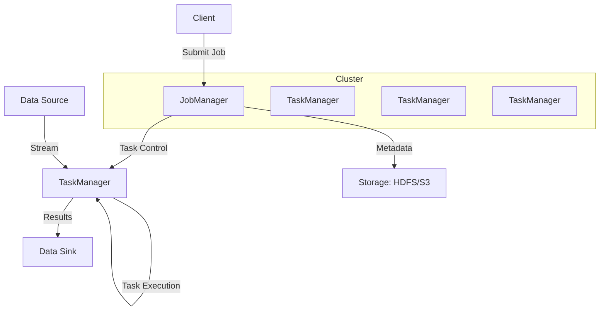
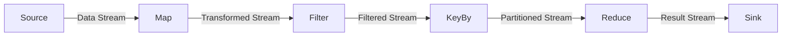
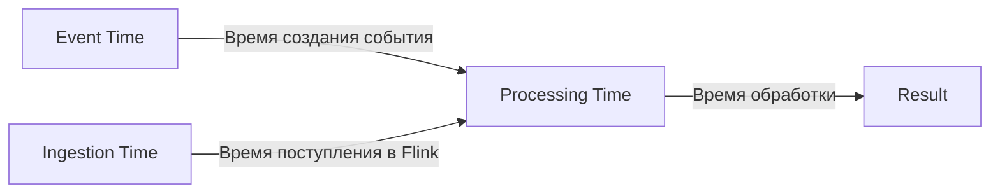
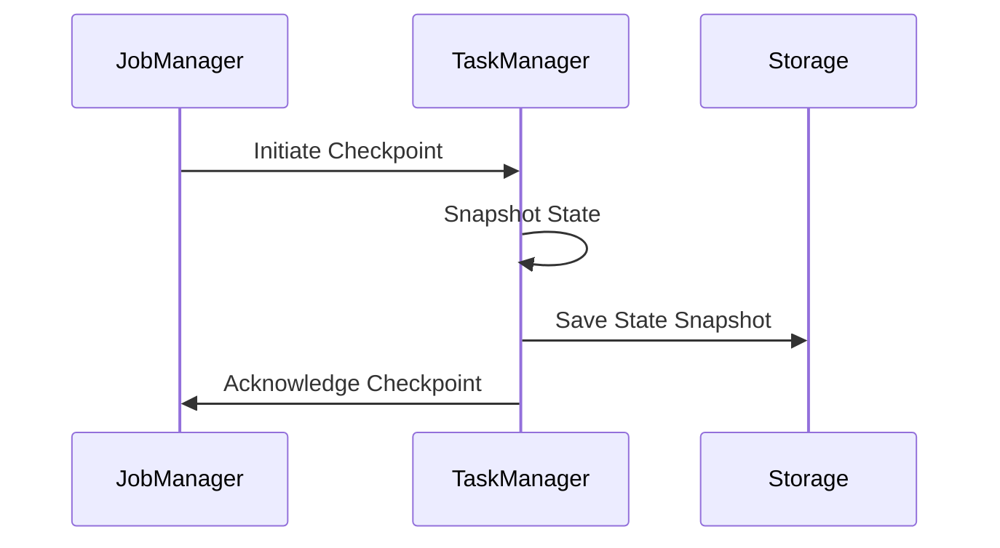

# Apache Flink

## Оглавление
1. [Введение](#введение)
2. [Архитектура Flink](#архитектура-flink)
3. [Основные концепции](#основные-концепции)
4. [Программные API](#программные-api)
5. [Обработка времени](#обработка-времени)
6. [Состояния и checkpointing](#состояния-и-checkpointing)
7. [Пример приложения](#пример-приложения)
8. [Use cases](#use-cases)

---

## Введение

**Apache Flink** — фреймворк для распределенной обработки потоков данных с высокой пропускной способностью и низкой задержкой. Поддерживает как потоковую, так и пакетную обработку.

### Ключевые особенности:
- ✅ **Истинная потоковая обработка** (не микропакетами)
- ✅ **Exactly-once семантика**
- ✅ **Поддержка событийного времени**
- ✅ **Высокая производительность**
- ✅ **Горизонтальное масштабирование**

---

## Архитектура Flink



### Компоненты:
- **JobManager**: Управляет выполнением заданий, распределяет задачи
- **TaskManager**: Выполняет задачи, управляет ресурсами
- **Client**: Компилирует и отправляет задания на выполнение

---

## Основные концепции

### Потоки и преобразования


### Операторы:
- **Source**: Источник данных (Kafka, файлы, сокеты)
- **Transformation**: Преобразования (map, filter, keyBy, window)
- **Sink**: Приемник результатов (базы данных, файлы, внешние системы)

---

## Программные API

### 1. DataStream API (потоковая обработка)
```java
DataStream<String> text = env.socketTextStream("localhost", 9999);
DataStream<Tuple2<String, Integer>> counts = text
    .flatMap((String value, Collector<Tuple2<String, Integer>> out) -> {
        for (String word : value.split(" ")) {
            out.collect(new Tuple2<>(word, 1));
        }
    })
    .keyBy(value -> value.f0)
    .window(TumblingEventTimeWindows.of(Time.seconds(5)))
    .sum(1);
```

### 2. DataSet API (пакетная обработка)
```java
DataSet<String> text = env.readTextFile("file:///path/to/file");
DataSet<Tuple2<String, Integer>> counts = text
    .flatMap(new Tokenizer())
    .groupBy(0)
    .sum(1);
```

### 3. Table API & SQL
```sql
SELECT window_start, word, COUNT(*) 
FROM TABLE(
    TUMBLE(TABLE word_count, DESCRIPTOR(event_time), INTERVAL '5' SECOND)
)
GROUP BY window_start, word;
```

---

## Обработка времени



### Типы времени:
- **Event Time**: Время создания события (наиболее важный)
- **Ingestion Time**: Время поступления в Flink
- **Processing Time**: Время обработки оператором

### Watermarks:
Механизм отслеживания прогресса событийного времени и обработки задержанных данных.

---

## Состояния и Checkpointing

### Состояния операторов:
- **Keyed State**: Состояние, привязанное к ключу
- **Operator State**: Состояние оператора без привязки к ключу

### Механизм checkpointing:


### Exactly-once гарантии:
Flink использует механизм чекпоинтов для восстановления состояния и позиций потребления после сбоев.

---

## Пример приложения

### Оконная агрегация в реальном времени
```java
StreamExecutionEnvironment env = StreamExecutionEnvironment.getExecutionEnvironment();

// Настройка времени событий
env.setStreamTimeCharacteristic(TimeCharacteristic.EventTime);

DataStream<SensorReading> readings = env
    .addSource(new SensorSource())
    .assignTimestampsAndWatermarks(new BoundedOutOfOrdernessTimestampExtractor<SensorReading>(Time.seconds(5)) {
        @Override
        public long extractTimestamp(SensorReading element) {
            return element.getTimestamp();
        }
    });

DataStream<Tuple2<String, Double>> result = readings
    .keyBy(r -> r.getSensorId())
    .window(TumblingEventTimeWindows.of(Time.minutes(5)))
    .process(new TemperatureAverager());

result.addSink(new RedisSink());
```

---

## Use Cases

### 1. Аналитика в реальном времени
- Мониторинг систем и приложений
- Анализ пользовательского поведения
- Обнаружение аномалий

### 2. Обработка событий
- Трансформация и обогащение данных
- CEP (Complex Event Processing)
- Обработка финансовых транзакций

### 3. ETL-процессы
- Непрерывная ETL-обработка
- Миграция данных между системами
- Обновление данных в реальном времени

### 4. Машинное обучение
- Обучение моделей на потоковых данных
- Онлайн-предсказания
- Обновление моделей в реальном времени

---

## Заключение

Apache Flink предоставляет мощную платформу для:
- ✅ Обработки потоков данных с низкой задержкой
- ✅ Сложных аналитических вычислений
- ✅ Гарантированной доставки и обработки
- ✅ Масштабируемых распределенных приложений

Благодаря своей архитектуре и возможностям, Flink является одним из ведущих фреймворков для обработки данных в реальном времени.

[Официальная документация](https://nightlies.apache.org/flink/flink-docs-stable/) | [Примеры проектов](https://github.com/apache/flink)