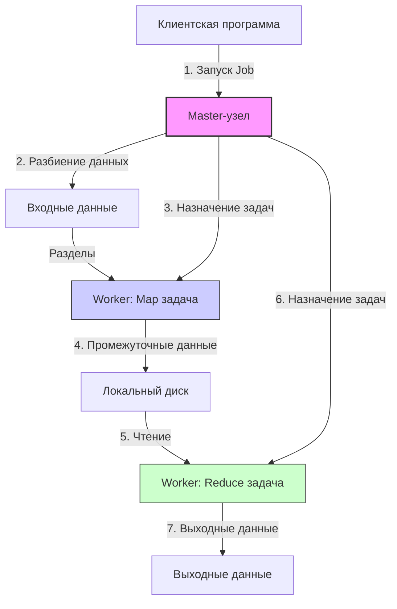
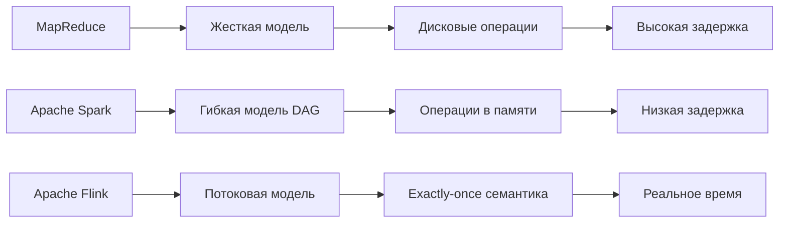

# MapReduce: принципы, архитектура и применения

## Содержание
1. Введение в проблематику
2. Исторический контекст
3. Основные принципы MapReduce
4. Архитектурные компоненты
5. Пример реализации
6. Оптимизации и расширения
7. Критика и ограничения
8. Современные альтернативы

---

## 1. Введение в проблематику

### Проблема обработки больших данных
В эпоху цифровой трансформации объемы данных растут экспоненциально. Традиционные подходы к обработке данных сталкиваются с фундаментальными ограничениями:

- **Объем данных**: тера- и петабайты информации
- **Вертикальное масштабирование**: ограничения односерверных систем
- **Распределенные системы**: сложность координации и отказоустойчивости

### Концептуальное решение
Модель MapReduce предлагает абстракцию для распределенной обработки данных, скрывающую сложности:
- Распараллеливания вычислений
- Распределения данных
- Обработки отказов

---

## 2. Исторический контекст

### Предшественники
- **Функциональное программирование**: функции `map` и `reduce` из Lisp (1958)
- **Параллельные базы данных**: shared-nothing архитектуры
- **Системы потоковой обработки**: pipeline обработки данных

### Прорыв Google
```text
2004: Публикация "MapReduce: Simplified Data Processing on Large Clusters"
Авторы: Jeffrey Dean и Sanjay Ghemawat
Контекст: Обработка веб-индекса для Google Search
```

---

## 3. Основные принципы MapReduce

### Функциональная парадигма
Модель основана на двух функциях высшего порядка:

#### Функция Map
```python
map(k1, v1) → list(k2, v2)
```
- **Вход**: пара ключ-значение
- **Выход**: список промежуточных пар ключ-значение
- **Семантика**: независимая обработка каждой входной записи

#### Функция Reduce
```python
reduce(k2, list(v2)) → list(v3)
```
- **Вход**: ключ и список всех значений для этого ключа
- **Выход**: список выходных значений
- **Семантика**: агрегация значений по ключам

### Вычислительная модель

```
┌─────────────────────────────────────────────────────────────┐
│                     Модель выполнения                       │
├─────────────────────────────────────────────────────────────┤
│                                                            │
│  Входные данные → Разбиение → Map → Shuffle → Reduce → Выход │
│                                                            │
└─────────────────────────────────────────────────────────────┘
```

---

## 4. Архитектурные компоненты

### Высокоуровневая архитектура



### Роли компонентов

#### Master-узел
- Координация выполнения задания
- Мониторинг Worker-узлов
- Повторное планирование failed задач

#### Worker-узлы
- Выполнение Map и Reduce задач
- Локальное хранение промежуточных данных
- Отправка heartbeat в Master

### Жизненный цикл задания

```
┌─────────────┐     ┌─────────────┐     ┌──────────────┐
│   Split     │────▶│    Map      │────▶│   Shuffle    │
│  (M штук)   │     │  фаза       │     │    фаза      │
└─────────────┘     └─────────────┘     └──────────────┘
                                                        │
┌─────────────┐     ┌─────────────┐     ┌──────────────┐
│   Output    │◀────│   Reduce    │◀────│   Reduce     │
│  (R файлов) │     │   фаза      │     │  разделы     │
└─────────────┘     └─────────────┘     └──────────────┘
```

---

## 5. Пример реализации

### Задача: WordCount
Подсчет частоты слов в большом корпусе текстов

#### Псевдокод
```python
# Функция Map
def map(doc_id, document):
    for word in document.split():
        emit(word, 1)

# Функция Reduce  
def reduce(word, counts):
    total = 0
    for count in counts:
        total += count
    emit(word, total)
```

#### Визуализация данных

```
Входные данные:
[("doc1", "hello world hello"),
 ("doc2", "world hello mapreduce")]

Фаза Map:
Map1: ("hello", 1), ("world", 1), ("hello", 1)
Map2: ("world", 1), ("hello", 1), ("mapreduce", 1)

Shuffle и группировка:
"hello": [1, 1, 1]
"world": [1, 1]  
"mapreduce": [1]

Фаза Reduce:
"hello": 3
"world": 2
"mapreduce": 1
```

### Схема потоков данных

```
┌─────────────────────────────────────────────────────────────────┐
│                      Пример: WordCount                          │
├─────────────────────────────────────────────────────────────────┤
│                                                                 │
│  Вход:                                                          │
│  ┌──────────┐    ┌──────────┐    ┌──────────┐                  │
│  │ Документ │    │ Документ │    │ Документ │                  │
│  │    1     │    │    2     │    │    3     │                  │
│  └──────────┘    └──────────┘    └──────────┘                  │
│       │               │               │                        │
│  ┌────┴───────────────┴───────────────┴────┐                   │
│  │            Разбиение на блоки           │                   │
│  └────┬───────────────┬───────────────┬────┘                   │
│       │               │               │                        │
│  ┌────▼────┐    ┌────▼────┐    ┌────▼────┐                    │
│  │  Map    │    │  Map    │    │  Map    │                    │
│  │ задание │    │ задание │    │ задание │                    │
│  │   1     │    │   2     │    │   3     │                    │
│  └────┬────┘    └────┬────┘    └────┬────┘                    │
│       │               │               │                        │
│       ▼               ▼               ▼                        │
│  (word1, 1)     (word2, 1)     (word1, 1)                     │
│  (word2, 1)     (word1, 1)     (word3, 1)                     │
│  (word1, 1)     (word3, 1)                                     │
│                                                                 │
│                    Shuffle и сортировка                        │
│                         │                                       │
│                         ▼                                       │
│                word1: [1, 1, 1, 1]                             │
│                word2: [1, 1]                                   │
│                word3: [1, 1]                                   │
│                         │                                       │
│                 ┌───────┴───────┐                             │
│                 │               │                             │
│            ┌────▼────┐    ┌────▼────┐                       │
│            │ Reduce  │    │ Reduce  │                       │
│            │ задание │    │ задание │                       │
│            │    1    │    │    2    │                       │
│            └────┬────┘    └────┬────┘                       │
│                 │               │                             │
│                 ▼               ▼                             │
│            (word1, 4)     (word2, 2)                         │
│                           (word3, 2)                         │
│                                                                 │
└─────────────────────────────────────────────────────────────────┘
```

---

## 6. Оптимизации и расширения

### Combiner функция
```python
# Локальная агрегация на Map-узлах
def combine(word, counts):
    emit(word, sum(counts))
```

### Схема работы Combiner

```
┌─────────────────────────────────────────────────────┐
│          Оптимизация с использованием Combiner      │
├─────────────────────────────────────────────────────┤
│                                                     │
│  Без Combiner:                                      │
│  Map → (k, v1), (k, v2), (k, v3) → Сеть → Reduce   │
│                                                     │
│  С Combiner:                                        │
│  Map → (k, [v1, v2, v3]) → Combiner → (k, sum)     │
│          ↓                                         │
│  Уменьшение передачи данных по сети                │
│                                                     │
└─────────────────────────────────────────────────────┘
```

### Паттерны проектирования

```
┌────────────────────────┬─────────────────────────────┐
│       Паттерн          │         Пример              │
├────────────────────────┼─────────────────────────────┤
│ Фильтрация             │ grep, sampling              │
│ Агрегация              │ count, sum, average         │
│ Join                   │ inner, outer, semi-join     │
│ Сортировка             │ total, partial              │
│ Итеративная обработка  │ PageRank, k-means           │
└────────────────────────┴─────────────────────────────┘
```

---

## 7. Критика и ограничения

### Основные ограничения

#### Вычислительная модель
```
┌─────────────────────────────────────────────────┐
│             Ограничения MapReduce               │
├─────────────────────────────────────────────────┤
│                                                 │
│ 1. Жесткая модель: Map → Shuffle → Reduce      │
│    - Сложность реализации итеративных алгоритмов│
│    - Неэффективность для графовых вычислений    │
│                                                 │
│ 2. Дисковые операции:                           │
│    - Промежуточные данные на диске              │
│    - Высокая задержка при итерациях             │
│                                                 │
│ 3. Отсутствие индексов:                         │
│    - Полное сканирование данных                 │
│    - Неэффективные join-операции                │
│                                                 │
│ 4. Сложность отладки:                           │
│    - Распределенная среда                       │
│    - Задержка получения результатов             │
│                                                 │
└─────────────────────────────────────────────────┘
```

### Сравнение с MPI
```
MapReduce vs. MPI (Message Passing Interface)

┌──────────────────┬────────────────────┬──────────────────┐
│   Аспект         │     MapReduce      │       MPI        │
├──────────────────┼────────────────────┼──────────────────┤
│ Модель           │ Данно-центричная   │ Процесс-центрич. │
│ Отказоустойчивость│ Встроенная        │ Отсутствует      │
│ Сложность        │ Низкая             │ Высокая          │
│ Гибкость         │ Ограниченная       │ Полная           │
│ Производительность│ Средняя           │ Высокая          │
└──────────────────┴────────────────────┴──────────────────┘
```

---

## 8. Современные альтернативы

### Эволюция экосистемы

```
       ┌─────────────┐
       │ MapReduce   │
       │  (2004)     │
       └──────┬──────┘
              │
    ┌─────────┴──────────┐
    ▼                    ▼
┌─────────┐        ┌─────────┐
│  Hive   │        │ Spark   │
│(SQL-инт.)│        │(RDD/DAG)│
└─────────┘        └─────────┘
    │                    │
    ▼                    ▼
┌─────────┐        ┌─────────┐
│ Presto  │        │ Flink   │
│(интеракт.)│       │(потоки)  │
└─────────┘        └─────────┘
```

### Apache Spark
```python
# Аналогичная задача в Spark
rdd = spark.textFile("hdfs://...")
word_counts = rdd.flatMap(lambda line: line.split()) \
                 .map(lambda word: (word, 1)) \
                 .reduceByKey(lambda a, b: a + b)
```

### Сравнение архитектур



---

## Заключение

### Ключевые выводы

1. **Абстракция над сложностью**: MapReduce скрывает распределенные детали
2. **Масштабируемость**: линейное масштабирование до тысяч узлов
3. **Отказоустойчивость**: автоматическое восстановление при сбоях
4. **Ограниченная применимость**: подходит для batch-обработки

### Историческое значение
- Стандартизация распределенной обработки данных
- Стимулирование развития экосистемы Big Data
- Влияние на открытые реализации (Hadoop)

### Современный контекст
Модель MapReduce остается:
- Концептуальной основой для понимания распределенных вычислений
- Практическим решением для специфических batch-задач
- Историческим этапом в эволюции систем обработки данных

---

## Рекомендуемая литература

1. Dean, J., & Ghemawat, S. (2004). MapReduce: Simplified Data Processing on Large Clusters
2. White, T. (2015). Hadoop: The Definitive Guide
3. Zaharia, M., et al. (2016). Apache Spark: A Unified Engine for Big Data Processing
4. Karau, H., et al. (2015). Learning Spark: Lightning-Fast Big Data Analysis

## Вопросы для самопроверки

1. Каковы основные преимущества и недостатки модели MapReduce по сравнению с MPI?
2. Как функция Combiner улучшает производительность системы?
3. Почему MapReduce неэффективен для итеративных алгоритмов?
4. Какие альтернативы MapReduce существуют для потоковой обработки?
5. Как обеспечивается отказоустойчивость в архитектуре MapReduce?