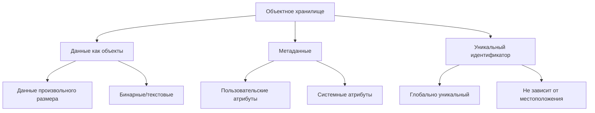
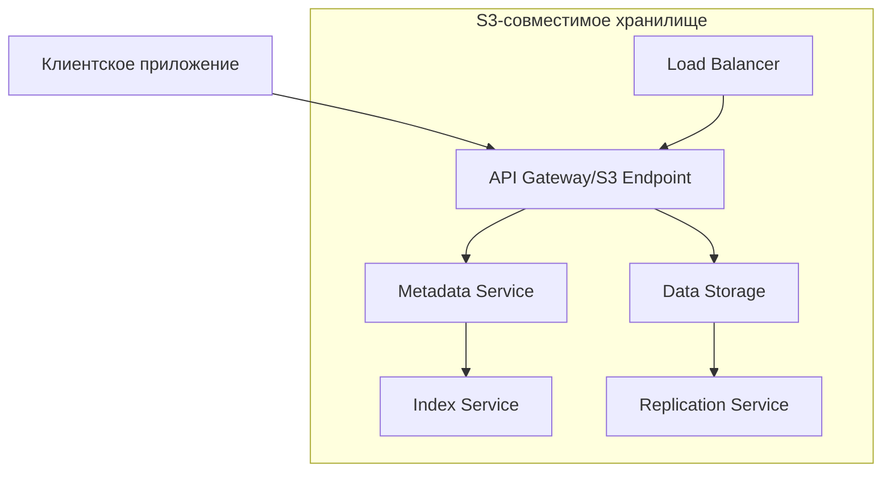
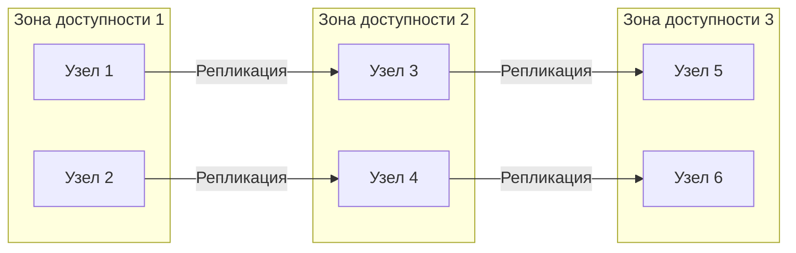
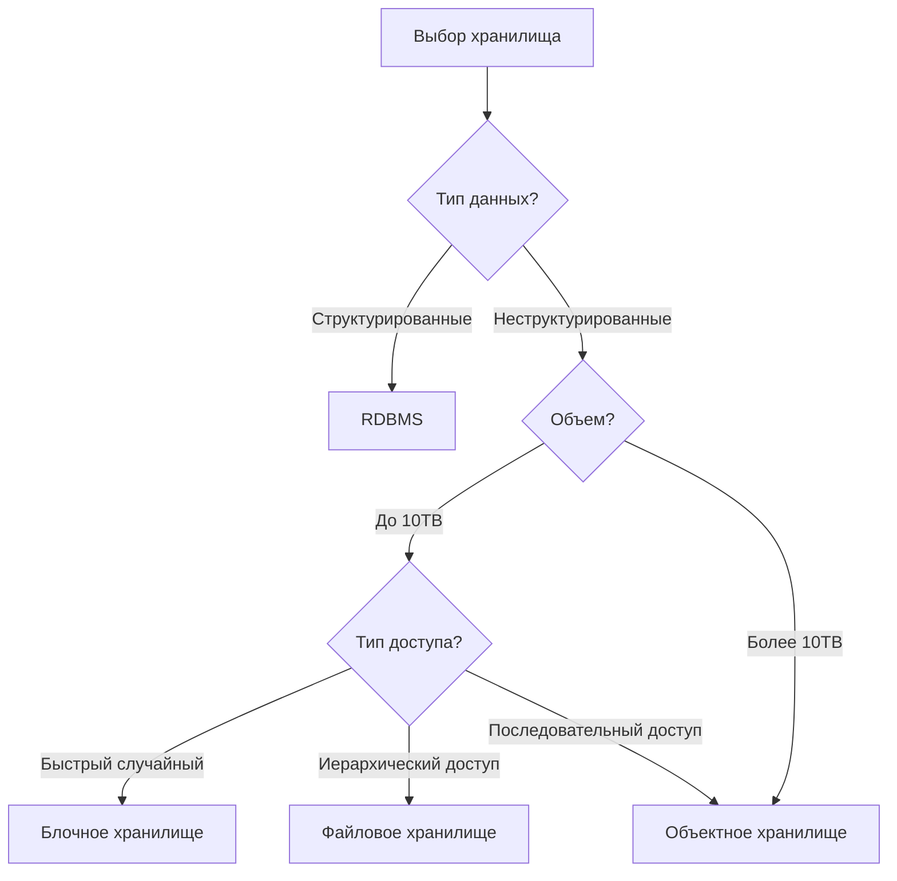
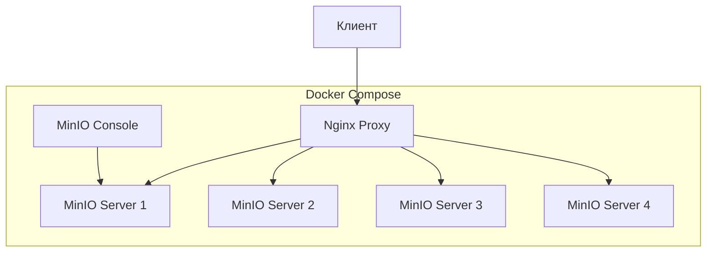
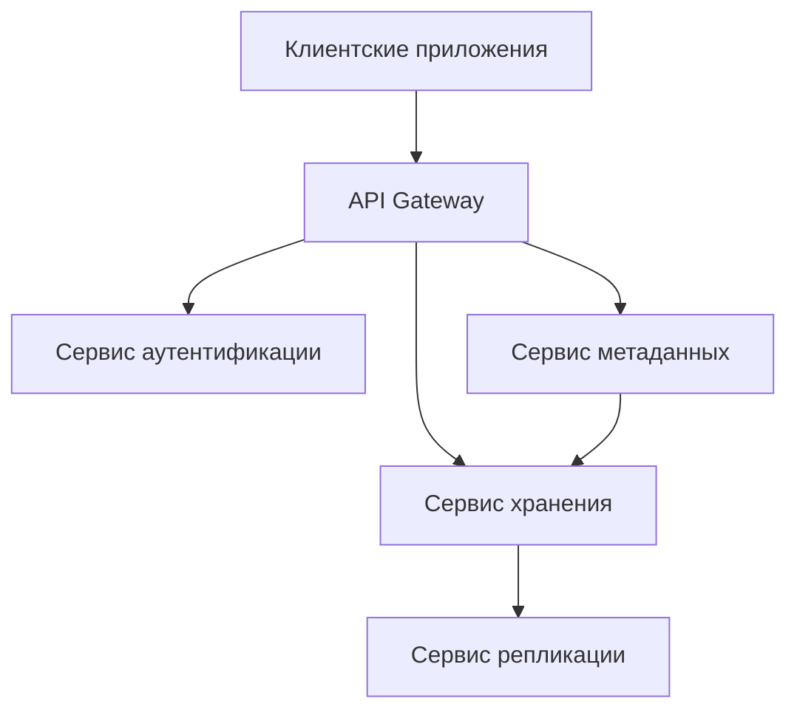
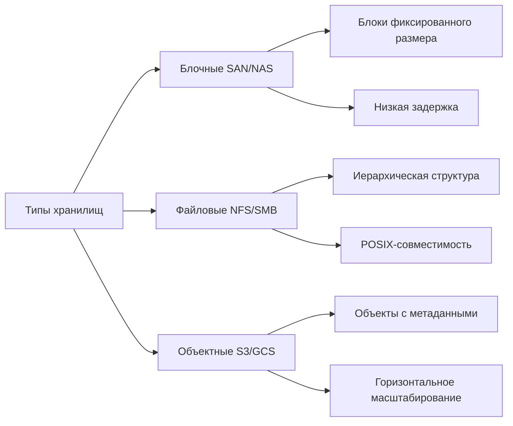
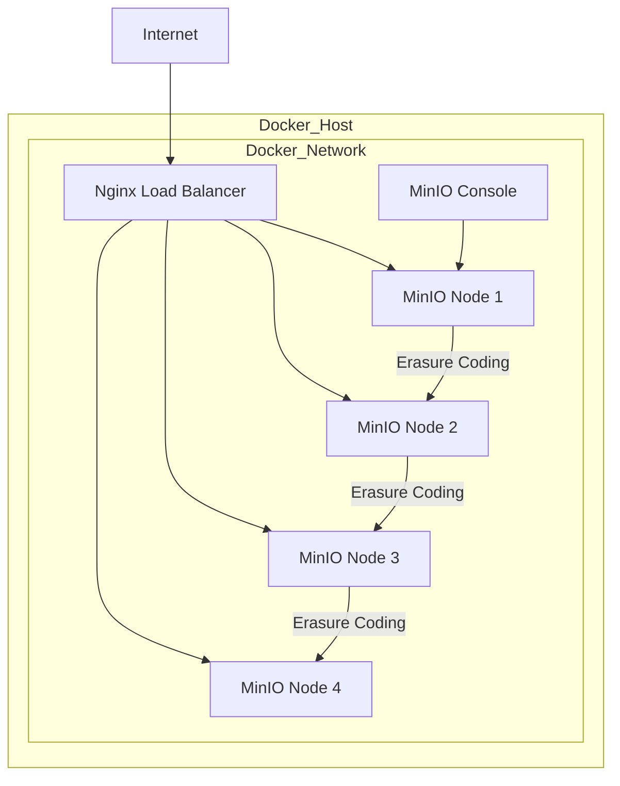

# Лекция: Объектные хранилища типа Amazon S3 - Архитектура, применение и практика

---

## Содержание
1. [Введение в объектные хранилища](#1-введение-в-объектные-хранилища)
2. [Архитектура S3-подобных систем](#2-архитектура-s3-подобных-систем)
3. [Преимущества и недостатки](#3-преимущества-и-недостатки)
4. [Сценарии применения](#4-сценарии-применения)
5. [Практика: MinIO в Docker](#5-практика-minio-в-docker)
6. [Заключение](#6-заключение)

---

## 1. Введение в объектные хранилища

### 1.1 Что такое объектное хранилище?

**Объектное хранилище** - это архитектура хранения данных, которая управляет данными как объектами, в отличие от:
- **Блочных хранилищ** (SAN, iSCSI) - работают с блоками фиксированного размера
- **Файловых хранилищ** (NFS, CIFS) - работают с иерархической структурой файлов и папок

### 1.2 Ключевые характеристики



### 1.3 Эволюция хранения данных

```
Эволюция систем хранения:
1. Локальные диски (DAS) → 1990-е
2. Сети хранения (SAN/NAS) → 2000-е
3. Объектные хранилища → 2010-е
4. Многооблачные хранилища → 2020-е
```

---

## 2. Архитектура S3-подобных систем

### 2.1 Компоненты архитектуры



### 2.2 Детали компонентов

#### **2.2.1 API Gateway**
- RESTful API (HTTP/HTTPS)
- Поддержка S3 API
- Аутентификация (AWS Signature v4)
- Роутинг запросов

#### **2.2.2 Сервис метаданных**
- Хранит информацию об объектах
- Использует БД (Cassandra, PostgreSQL, etcd)
- Индексирует объекты
- Управляет политиками доступа

#### **2.2.3 Хранилище данных**
- Распределенная файловая система
- Erasure coding/репликация
- Холодное/горячее хранение

### 2.3 Протокол S3 API

```yaml
# Основные операции S3 API
operations:
  bucket:
    - CreateBucket
    - DeleteBucket
    - ListBuckets
    - GetBucketLocation
    
  object:
    - PutObject
    - GetObject
    - DeleteObject
    - ListObjectsV2
    - CopyObject
    
  multipart:
    - CreateMultipartUpload
    - UploadPart
    - CompleteMultipartUpload
    - AbortMultipartUpload
```

### 2.4 Модель данных

```python
class S3Object:
    def __init__(self):
        self.key: str          # Уникальный идентификатор
        self.bucket: str       # Контейнер для объектов
        self.data: bytes       # Содержимое объекта
        self.metadata: dict    # Пользовательские метаданные
        self.system_metadata: dict  # Системные метаданные
        self.version_id: str   # Идентификатор версии
        self.etag: str         # Хэш содержимого
```

### 2.5 Распределенность и отказоустойчивость



---

## 3. Преимущества и недостатки

### 3.1 Преимущества объектных хранилищ

| Преимущество | Описание | Пример использования |
|-------------|----------|---------------------|
| **Масштабируемость** | Линейное масштабирование | От терабайт до эксабайт |
| **Долговечность** | 99.999999999% (11 девяток) | Архивация критичных данных |
| **Доступность** | 99.99% SLA | Веб-хостинг статики |
| **Простота API** | RESTful интерфейс | Интеграция с любым языком |
| **Экономичность** | Плата за использование | Хранение логов, бэкапов |
| **Гибкость метаданных** | Произвольные атрибуты | Поиск и категоризация |

### 3.2 Недостатки и ограничения

| Недостаток | Влияние | Обходные пути |
|-----------|---------|---------------|
| **Отсутствие транзакций** | Нет ACID гарантий | Внешние системы управления |
| **Нет частичных обновлений** | Перезапись всего объекта | Версионирование, композиция |
| **Задержки** | Выше чем у блочных хранилищ | Кэширование, CDN |
| **Стоимость операций** | PUT/GET тарифицируются | Оптимизация доступа |
| **Ограничения именования** | Специфичные правила бакетов | Префиксные стратегии |

### 3.3 Сравнение с другими типами хранилищ



---

## 4. Сценарии применения

### 4.1 Идеальные сценарии использования ✅

#### **4.1.1 Статический веб-контент**
```yaml
use_case: "Веб-хостинг"
why_good:
  - Высокая доступность
  - Масштабируемость под нагрузку
  - Интеграция с CDN
  - Экономически эффективно
examples:
  - Изображения сайта
  - JavaScript/CSS файлы
  - Видео для стриминга
```

#### **4.1.2 Резервное копирование и архивирование**
```yaml
use_case: "Бэкапы и архив"
why_good:
  - Долговечность хранения
  - Версионирование объектов
  - Жизненные циклы (Lifecycle Policies)
  - Гео-репликация
examples:
  - Логи приложений
  - Бэкапы баз данных
  - Архив документов
```

#### **4.1.3 Big Data и аналитика**
```yaml
use_case: "Озеро данных (Data Lake)"
why_good:
  - Хранение любых форматов
  - Параллельная обработка
  - Интеграция с аналитическими инструментами
  - Отделение хранения от вычислений
examples:
  - Логи серверов
  - Данные IoT устройств
  - Результаты ML-моделей
```

### 4.2 Неподходящие сценарии ❌

#### **4.2.1 Базы данных OLTP**
```
Почему не подходит:
• Высокие задержки (10-100ms vs <1ms)
• Нет поддержки транзакций
• Отсутствие блокировок
• Сложные обновления данных
```

#### **4.2.2 Виртуальные машины и диски**
```
Почему не подходит:
• Блочный доступ требуется
• Низкая задержка критична
• Кэширование ОС неэффективно
• Частые мелкие обновления
```

#### **4.2.3 Файловые системы пользователей**
```
Проблемы:
• Переименование = копирование
• Нет POSIX-совместимости
• Сложная структура каталогов
• Частые метаданные операции
```

### 4.3 Паттерны доступа

```python
# Паттерны доступа к объектному хранилищу
patterns = {
    "write_once_read_many": {
        "description": "Запись один раз, чтение много раз",
        "примеры": ["логи", "архивы", "медиафайлы"],
        "оптимизация": "Кэширование, CDN"
    },
    
    "write_many_read_rarely": {
        "description": "Частая запись, редкое чтение",
        "примеры": ["бэкапы", "аудитные логи"],
        "оптимизация": "Lifecycle policies для архивации"
    },
    
    "write_once_read_never": {
        "description": "Запись для соответствия требованиям",
        "примеры": ["юридические архивы"],
        "оптимизация": "Холодное хранение, WORM политики"
    }
}
```

---

## 5. Практика: MinIO в Docker

### 5.1 Что такое MinIO?

**MinIO** - это высокопроизводительное, S3-совместимое объектное хранилище с открытым исходным кодом.

### 5.2 Архитектура развертывания



### 5.3 Полный docker-compose.yml

```yaml
version: '3.8'

services:
  # MinIO сервер в распределенном режиме
  minio1:
    image: minio/minio:latest
    container_name: minio1
    command: server http://minio{1...4}/data{1...2} --console-address ":9001"
    environment:
      MINIO_ROOT_USER: minioadmin
      MINIO_ROOT_PASSWORD: minioadmin
      MINIO_SERVER_URL: http://minio1:9000
      MINIO_BROWSER_REDIRECT_URL: http://localhost:9001
    volumes:
      - minio1_data1:/data1
      - minio1_data2:/data2
    networks:
      - minio_cluster
    healthcheck:
      test: ["CMD", "mc", "ready", "local"]
      interval: 30s
      timeout: 20s
      retries: 3

  minio2:
    image: minio/minio:latest
    container_name: minio2
    command: server http://minio{1...4}/data{1...2} --console-address ":9001"
    environment:
      MINIO_ROOT_USER: minioadmin
      MINIO_ROOT_PASSWORD: minioadmin
      MINIO_SERVER_URL: http://minio2:9000
    volumes:
      - minio2_data1:/data1
      - minio2_data2:/data2
    networks:
      - minio_cluster

  minio3:
    image: minio/minio:latest
    container_name: minio3
    command: server http://minio{1...4}/data{1...2} --console-address ":9001"
    environment:
      MINIO_ROOT_USER: minioadmin
      MINIO_ROOT_PASSWORD: minioadmin
      MINIO_SERVER_URL: http://minio3:9000
    volumes:
      - minio3_data1:/data1
      - minio3_data2:/data2
    networks:
      - minio_cluster

  minio4:
    image: minio/minio:latest
    container_name: minio4
    command: server http://minio{1...4}/data{1...2} --console-address ":9001"
    environment:
      MINIO_ROOT_USER: minioadmin
      MINIO_ROOT_PASSWORD: minioadmin
      MINIO_SERVER_URL: http://minio4:9000
    volumes:
      - minio4_data1:/data1
      - minio4_data2:/data2
    networks:
      - minio_cluster

  # Консоль управления MinIO
  console:
    image: minio/console:latest
    container_name: minio_console
    ports:
      - "9001:9001"
    environment:
      MINIO_SERVER_URL: "http://minio1:9000"
      CONSOLE_SECURE_TLS: "false"
    networks:
      - minio_cluster
    depends_on:
      - minio1

  # Nginx для балансировки нагрузки
  nginx:
    image: nginx:alpine
    container_name: minio_nginx
    ports:
      - "9000:9000"  # S3 API
      - "9002:9001"  # Console через proxy
    volumes:
      - ./nginx.conf:/etc/nginx/nginx.conf:ro
    networks:
      - minio_cluster
    depends_on:
      - minio1
      - minio2
      - minio3
      - minio4

  # Клиент для тестирования
  mc:
    image: minio/mc:latest
    container_name: minio_client
    entrypoint: >
      /bin/sh -c "
      until /usr/bin/mc ready local; do
        echo 'Waiting for MinIO...';
        sleep 2;
      done;
      /usr/bin/mc alias set local http://nginx:9000 minioadmin minioadmin;
      /usr/bin/mc mb local/test-bucket;
      /usr/bin/mc anonymous set public local/test-bucket;
      echo 'MinIO is ready!';
      tail -f /dev/null
      "
    networks:
      - minio_cluster
    depends_on:
      - nginx

volumes:
  minio1_data1:
  minio1_data2:
  minio2_data1:
  minio2_data2:
  minio3_data1:
  minio3_data2:
  minio4_data1:
  minio4_data2:

networks:
  minio_cluster:
    driver: bridge
```

### 5.4 Конфигурация Nginx

```nginx
# nginx.conf
events {
    worker_connections 1024;
}

http {
    upstream minio_servers {
        least_conn;
        server minio1:9000;
        server minio2:9000;
        server minio3:9000;
        server minio4:9000;
    }

    upstream console_servers {
        least_conn;
        server minio1:9001;
        server minio2:9001;
        server minio3:9001;
        server minio4:9001;
    }

    server {
        listen 9000;
        
        # S3 API
        location / {
            proxy_pass http://minio_servers;
            proxy_set_header Host $http_host;
            proxy_set_header X-Real-IP $remote_addr;
            proxy_set_header X-Forwarded-For $proxy_add_x_forwarded_for;
            proxy_set_header X-Forwarded-Proto $scheme;
            
            # Важно для S3 API
            proxy_connect_timeout 300;
            proxy_http_version 1.1;
            proxy_set_header Connection "";
            chunked_transfer_encoding off;
        }
    }

    server {
        listen 9001;
        
        # Console
        location / {
            proxy_pass http://console_servers;
            proxy_set_header Host $http_host;
            proxy_set_header X-Real-IP $remote_addr;
            proxy_set_header X-Forwarded-For $proxy_add_x_forwarded_for;
            proxy_set_header X-Forwarded-Proto $scheme;
            proxy_set_header X-NginX-Proxy true;
            
            proxy_connect_timeout 300;
            
            # WebSocket support
            proxy_http_version 1.1;
            proxy_set_header Upgrade $http_upgrade;
            proxy_set_header Connection "upgrade";
        }
    }
}
```

### 5.5 Скрипты для работы

#### **5.5.1 Скрипт запуска**
```bash
#!/bin/bash
# start-minio-cluster.sh

echo "Запуск MinIO кластера..."
docker-compose up -d

echo "Ожидание запуска сервисов..."
sleep 10

echo "Проверка состояния..."
docker-compose ps

echo "MinIO доступен по адресам:"
echo "S3 API: http://localhost:9000"
echo "Console: http://localhost:9002"
echo ""
echo "Учетные данные:"
echo "Access Key: minioadmin"
echo "Secret Key: minioadmin"
```

#### **5.5.2 Пример использования с Python**
```python
# s3_example.py
import boto3
from botocore.client import Config

# Настройка клиента
s3_client = boto3.client(
    's3',
    endpoint_url='http://localhost:9000',
    aws_access_key_id='minioadmin',
    aws_secret_access_key='minioadmin',
    config=Config(signature_version='s3v4'),
    region_name='us-east-1'
)

# 1. Создание бакета
def create_bucket(bucket_name):
    s3_client.create_bucket(Bucket=bucket_name)
    print(f"Бакет '{bucket_name}' создан")

# 2. Загрузка объекта
def upload_object(bucket, key, content):
    s3_client.put_object(
        Bucket=bucket,
        Key=key,
        Body=content,
        Metadata={'category': 'test', 'owner': 'dev'}
    )
    print(f"Объект '{key}' загружен")

# 3. Чтение объекта
def read_object(bucket, key):
    response = s3_client.get_object(Bucket=bucket, Key=key)
    content = response['Body'].read().decode('utf-8')
    metadata = response['Metadata']
    print(f"Содержимое: {content}")
    print(f"Метаданные: {metadata}")
    return content

# 4. Управление версиями
def enable_versioning(bucket):
    s3_client.put_bucket_versioning(
        Bucket=bucket,
        VersioningConfiguration={'Status': 'Enabled'}
    )
    print(f"Версионирование включено для '{bucket}'")

# 5. Политика жизненного цикла
def set_lifecycle_policy(bucket):
    lifecycle_config = {
        'Rules': [
            {
                'ID': 'Move to Glacier after 30 days',
                'Status': 'Enabled',
                'Filter': {'Prefix': 'archive/'},
                'Transitions': [
                    {
                        'Days': 30,
                        'StorageClass': 'GLACIER'
                    }
                ]
            }
        ]
    }
    
    s3_client.put_bucket_lifecycle_configuration(
        Bucket=bucket,
        LifecycleConfiguration=lifecycle_config
    )
    print(f"Политика жизненного цикла установлена")

# Пример использования
if __name__ == "__main__":
    bucket_name = "my-test-bucket"
    
    # Создание и настройка
    create_bucket(bucket_name)
    enable_versioning(bucket_name)
    set_lifecycle_policy(bucket_name)
    
    # Работа с данными
    upload_object(bucket_name, "test.txt", "Hello, MinIO!")
    content = read_object(bucket_name, "test.txt")
    
    # Список объектов
    objects = s3_client.list_objects_v2(Bucket=bucket_name)
    print(f"Объекты в бакете: {[obj['Key'] for obj in objects.get('Contents', [])]}")
```

### 5.6 Тестирование производительности

```bash
#!/bin/bash
# benchmark-minio.sh

echo "Тестирование производительности MinIO кластера..."

# 1. Загрузка тестовых данных
echo "1. Загрузка 100 файлов по 10MB..."
for i in {1..100}; do
    dd if=/dev/urandom of=testfile_$i.dat bs=1M count=10 status=none
    mc cp testfile_$i.dat local/test-bucket/
    rm testfile_$i.dat
done

# 2. Параллельная загрузка
echo "2. Параллельная загрузка (4 потока)..."
seq 1 20 | xargs -P 4 -I {} sh -c 'dd if=/dev/urandom of=parallel_{}.dat bs=1M count=5 && mc cp parallel_{}.dat local/test-bucket/ && rm parallel_{}.dat'

# 3. Чтение данных
echo "3. Тест чтения..."
time mc cp --recursive local/test-bucket/ ./downloads/

# 4. Очистка
echo "4. Очистка тестовых данных..."
rm -rf ./downloads/
mc rm --recursive --force local/test-bucket/

echo "Тестирование завершено!"
```

---

## 6. Заключение

### 6.1 Ключевые выводы

1. **Объектные хранилища** - это специализированные системы для неструктурированных данных
2. **S3 API** стал де-факто стандартом для облачных хранилищ
3. **Микросервисная архитектура** обеспечивает масштабируемость и отказоустойчивость
4. **Правильный выбор хранилища** зависит от паттернов доступа к данным

### 6.2 Будущие тенденции

| Тренд | Описание | Примеры |
|-------|----------|---------|
| **Унификация API** | Единый API для разных облаков | AWS S3, Google Cloud Storage, Azure Blob |
| **Интеллектуальное хранение** | ML для оптимизации хранения | Автоматическая классификация, сжатие |
| **Edge computing** | Хранение ближе к данным | IoT, мобильные приложения |
| **Безсерверная интеграция** | Прямая интеграция с FaaS | AWS Lambda, Google Cloud Functions |

### 6.3 Рекомендации по внедрению

```yaml
best_practices:
  naming_conventions:
    - "Используйте хэши в именах объектов"
    - "Префиксы для организации данных"
    - "Избегайте последовательных имен"
  
  performance:
    - "Мультипарт загрузка для больших файлов"
    - "Кэширование на стороне клиента"
    - "CDN для статического контента"
  
  cost_optimization:
    - "Lifecycle policies для архивации"
    - "Выбор правильного класса хранения"
    - "Компрессия данных перед загрузкой"
  
  security:
    - "Bucket policies и IAM"
    - "Шифрование на стороне сервера"
    - "Ведение логов доступа"
```

### 6.4 Полезные ресурсы

1. **Документация:**
   - [AWS S3 Documentation](https://docs.aws.amazon.com/s3/)
   - [MinIO Documentation](https://min.io/docs/minio/linux/index.html)
   - [S3 API Reference](https://docs.aws.amazon.com/AmazonS3/latest/API/Welcome.html)

2. **Инструменты:**
   - [MinIO](https://min.io/) - S3-совместимое хранилище
   - [s3cmd](https://s3tools.org/s3cmd) - CLI для S3
   - [rclone](https://rclone.org/) - Синхронизация облаков

3. **Библиотеки:**
   - [boto3 (Python)](https://boto3.amazonaws.com/v1/documentation/api/latest/index.html)
   - [AWS SDKs](https://aws.amazon.com/tools/) - Для различных языков
   - [MinIO SDKs](https://min.io/docs/minio/linux/developers/minio-drivers.html)

---

## Дополнительные материалы

### Схемы для GitHub README







---