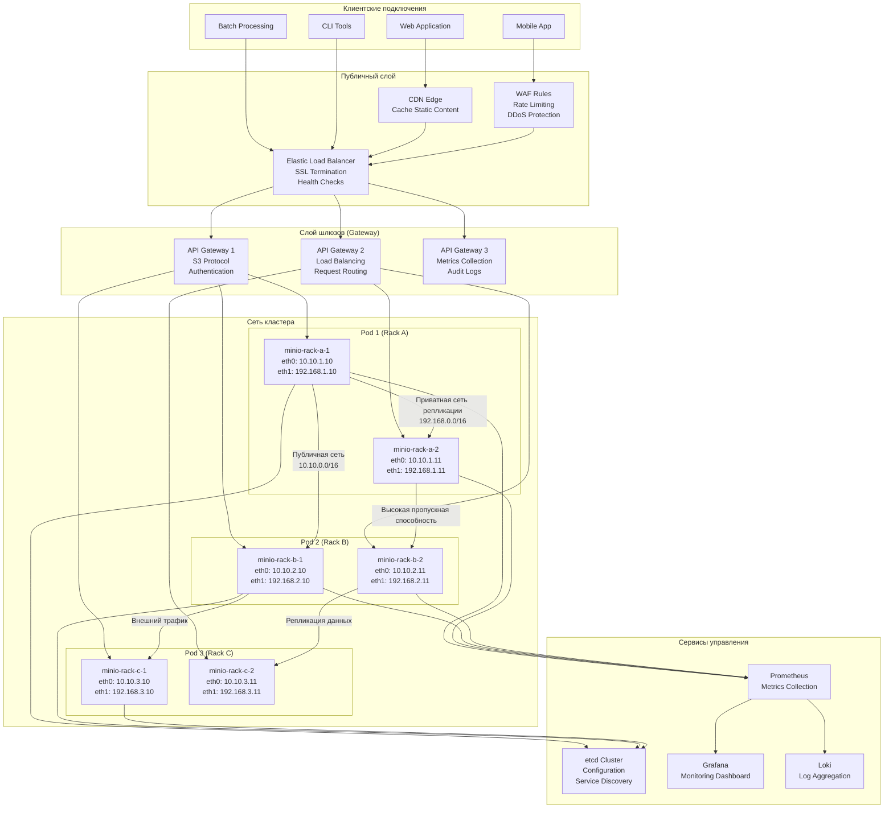

# Архитектура распределенного объектного хранилища: узлы, репликация, балансировка

---

## Детальная схема репликации данных

---

## Схема сетевой архитектуры и балансировки

---

## Схема процессов чтения/записи

---

## Физическая схема развертывания на ВМ/БМ

---

## Схема архитектуры репликации и консистентности

---

## Ключевые моменты архитектуры

### 1. **Размещение узлов на отдельных ВМ:**
- Каждая ВМ имеет выделенные CPU, RAM, диски
- Разделение сетей: public, storage, management
- Размещение в разных стойках/зонах доступности

### 2. **Репликация:**
- **Erasure Coding** для эффективности хранения
- **Кворумные операции** для консистентности
- **Многоуровневая репликация**: синхронная (внутри AZ), асинхронная (между регионами)

### 3. **Балансировка:**
- **L4/L7 балансировщики** на входе
- **Consistent hashing** для распределения данных
- **Health checks** и автоматическое исключение нерабочих узлов

### 4. **Отказоустойчивость:**
- Выдерживает отказ до `m` узлов (зависит от схемы erasure coding)
- Автоматическое восстановление данных с parity блоков
- Минимальное время простоя при отказе узла

### 5. **Масштабирование:**
- Горизонтальное масштабирование добавлением узлов
- Автоматическая перебалансировка данных
- Линейный рост производительности с добавлением узлов