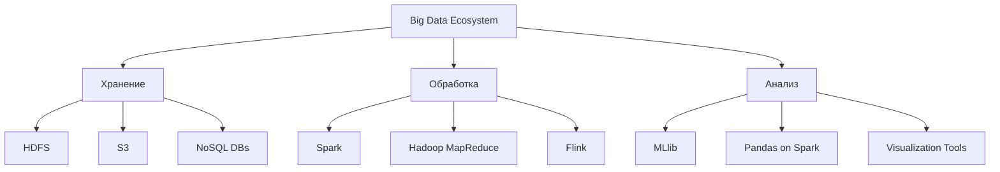

# Технологии обработки больших массивов данных | Big Data Processing Technologies

## 🚀 О курсе

Этот курс посвящен современным технологиям и методам обработки огромных объемов информации, которые стали неотъемлемой частью цифровой эпохи.

### 📊 Почему это важно?

> «Данные — это новая нефть, а технологии их обработки — refinery будущего»

В эпоху цифровой трансформации мы генерируем ошеломляющие объемы данных:
- 🌍 **2.5 квинтиллиона байт** данных создается ежедневно
- 📱 **90% всех мировых данных** было создано за последние 2 года
- ⚡ Ожидается рост до **175 зеттабайт** в этом году (2025 уже здесь!)

### 🎯 Цели курса

| Навык | Описание | Технологии |
|-------|----------|------------|
| **Масштабируемость** | Обработка данных от гигабайт до экзабайт | Hadoop, Spark |
| **Скорость** | Реальное время и потоковая обработка | Kafka, Flink |
| **Разнообразие** | Работа со структурированными и неструктурированными данными | NoSQL, Data Lakes |
| **Надежность** | Отказоустойчивость и согласованность | Distributed Systems |

### 🛠 Технологический стек

### 📚 Что вы освоите

- 🔧 **Проектирование** распределенных систем обработки данных
- ⚡ **Оптимизация** производительности big data приложений
- 🎯 **Реальные кейсы** из индустрии: e-commerce, IoT, финтех
- 📈 **Мониторинг** и управление кластерами больших данных
- 🔒 **Безопасность** и управление доступом в распределенных системах

### 🎓 Для кого этот курс

- 👨‍💻 **Data Engineers** — углубите знания распределенных систем
- 👩‍🔬 **Data Scientists** — научитесь работать с большими объемами данных
- 🧑‍💼 **IT-архитекторы** — проектируйте масштабируемые решения
- 🧑‍🎓 **Студенты** — получите востребованные навыки на рынке труда

---

💡 *Готовы погрузиться в мир распределенных вычислений и изменить подход к работе с данными? Давайте начнем это путешествие!*