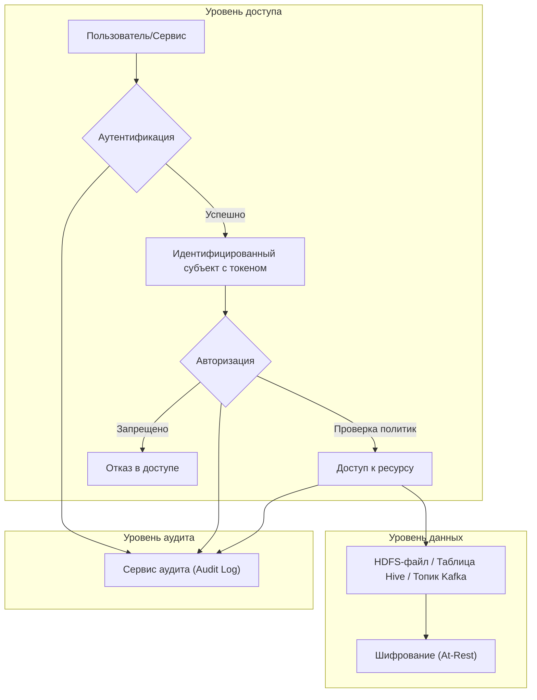
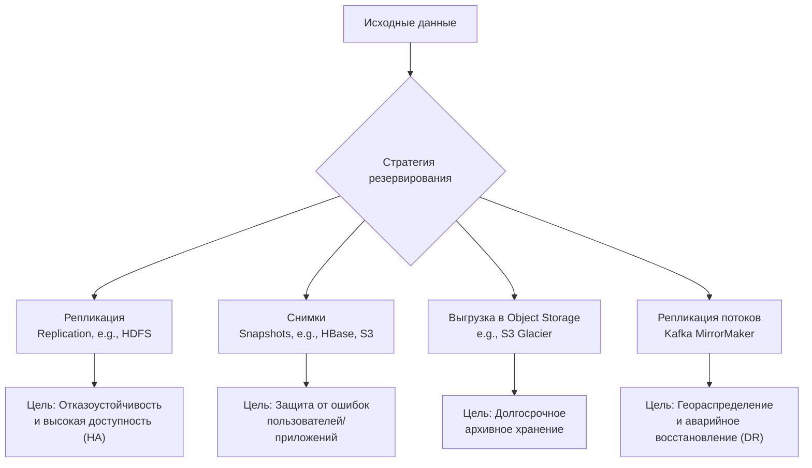
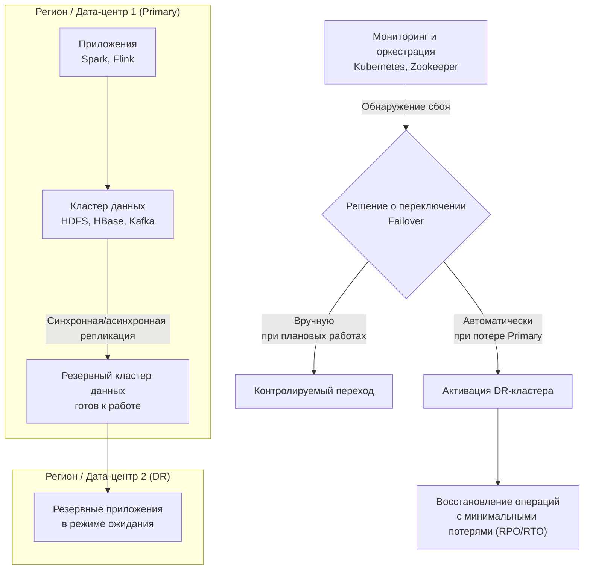
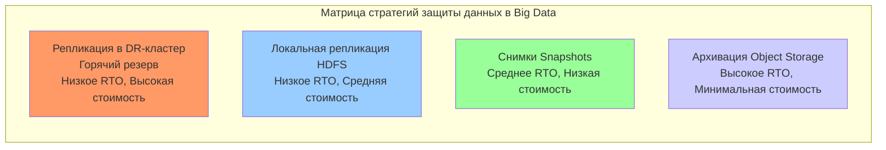
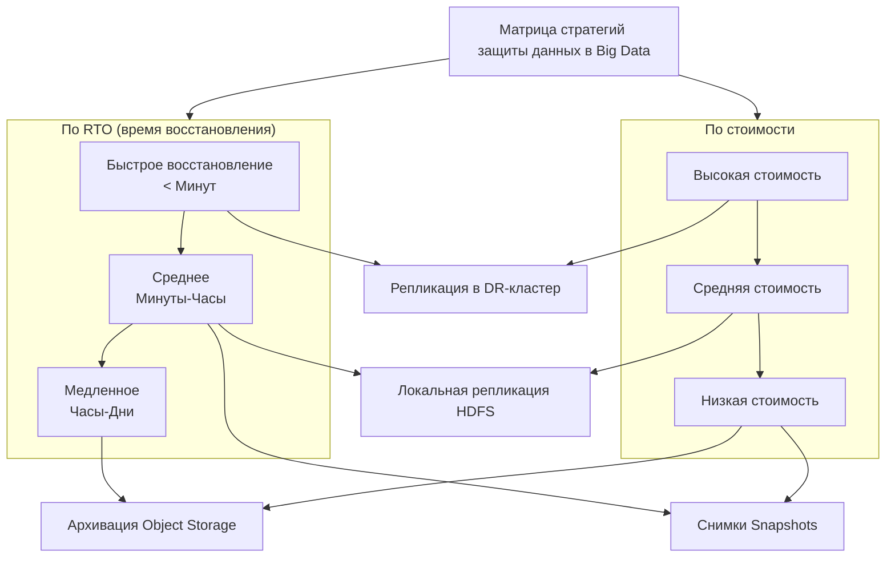

# **Лекция: Обеспечение безопасности и отказоустойчивости в экосистемах Big Data**

**Цель:** Понимать и уметь проектировать ключевые аспекты безопасности, доступности и сохранности данных в распределенных системах обработки больших данных.

---

### **Введение: Особенности Big Data**

Обработка больших массивов данных (Big Data) характеризуется тремя основными принципами — **Volume, Velocity, Variety (3V)**. Эти принципы напрямую влияют на архитектуру систем безопасности и резервирования:
*   **Объем (Volume):** Традиционные методы бэкапа неприменимы. Невозможно просто скопировать петабайты данных каждую ночь.
*   **Скорость (Velocity):** Непрерывный поток данных требует защиты и резервирования в реальном времени или близком к нему.
*   **Разнообразие (Variety):** Данные в разных форматах (структурированные, полуструктурированные, неструктурированные) требуют дифференцированных политик доступа и хранения.

**Ключевой принцип:** **Безопасность и отказоустойчивость должны быть заложены в архитектуру системы с самого начала, а не добавляться как надстройка.**

---

### **1. Многоуровневая модель безопасности: Аутентификация и Авторизация**

В распределенных системах, таких как Hadoop или кластеры на базе Kubernetes, доступ к данным и вычислительным ресурсам строго контролируется.

**Пояснение к схеме:**
Этот процесс демонстрирует последовательную проверку доступа в Big Data-системе.
1.  **Аутентификация (Authentication):** Проверка *"Кто вы?"*. Пользователь или сервис (например, Spark-задача) предъявляет учетные данные (логин/пароль, Kerberos-билет, TLS-сертификат, JWT-токен). В экосистеме Hadoop для этого часто используется **Kerberos** — мощный протокол взаимной аутентификации, предотвращающий спуфинг как клиента, так и сервера.
2.  **Авторизация (Authorization):** Проверка *"Что вам разрешено?"*. После успешной идентификации система проверяет права субъекта на доступ к конкретному ресурсу. Используются модели:
    *   **RBAC (Role-Based Access Control):** Права назначаются ролям (например, `analyst`, `data_engineer`), а пользователи получают роли. Практический стандарт в современных системах (Apache Ranger, Sentry, облачные IAM).
    *   **ACL (Access Control Lists):** Списки прав доступа, привязанные непосредственно к объекту (файлу в HDFS, топику в Kafka).
3.  **Шифрование (At-Rest):** Данные на дисках в распределенном хранилище (HDFS, S3) должны быть зашифрованы. Это последний рубеж защиты на случай физического доступа к носителям.
4.  **Аудит (Audit):** Все события аутентификации и авторизации, а также операции с данными (чтение, запись, изменение) логируются в централизованный сервис аудита. Это необходимо для расследования инцидентов и соответствия регуляторным требованиям (GDPR, ФЗ-152).

---

### **2. Стратегии резервного копирования (Бэкапа) для Big Data**

Классический "полный бэкап" не работает. Используются комбинированные стратегии.

**Пояснение к схеме:**
*   **Репликация (Replication):** Базовая стратегия. Каждый блок данных в HDFS или объект в S3 по умолчанию хранится в 3 копиях на разных серверах (`dfs.replication=3`). Это **не бэкап**, а механизм **отказоустойчивости** и высокой доступности. Защищает от выхода из строя диска или сервера.
*   **Снимки (Snapshots):** Моментальные read-only копии состояния данных в определенный момент времени. Создаются почти мгновенно (за счет механизма copy-on-write). **Ключевое применение:** "Спасательный круг" перед рискованными операциями (миграция, обновление, запуск сложного ETL). Позволяют откатиться к состоянию на момент снимка.
*   **Выгрузка в архивное Object Storage:** "Холодные" исторические данные, к которым редко обращаются, выгружаются в дешевые архивные хранилища (AWS S3 Glacier, Azure Archive Storage, Яндекс Object Storage "Холодное"). Восстановление занимает часы, но стоимость хранения минимальна.
*   **Репликация потоков данных:** Для систем реального времени (Apache Kafka) используется инструмент **MirrorMaker** для создания точных копий топиков в другом кластере (в другом дата-центре или облаке). Основа для построения **Disaster Recovery (DR)** плана.

---

### **3. Политика отказоустойчивости и аварийного восстановления (DR)**

Цель — обеспечить непрерывность бизнес-процессов при сбоях любого масштаба.

**Пояснение к схеме:**
*   **Отказоустойчивость (High Availability, HA):** Обеспечивается **внутри** одного кластера: репликация данных, резервирование компонентов (два NameNode в Hadoop, несколько брокеров в Kafka), автоматический перезапуск упавших контейнеров (Kubernetes). Цель — пережить отказ одного или нескольких узлов без остановки сервиса.
*   **Аварийное восстановление (Disaster Recovery, DR):** План на случай катастрофического отказа **всего основного дата-центра или региона**. Требует наличия **второго, географически удаленного кластера**.
*   **Ключевые метрики DR:**
    *   **RPO (Recovery Point Objective):** Допустимый объем потери данных. Определяет, как часто нужно реплицировать данные (например, RPO=1 час). Зависит от метода репликации (синхронная -> RPO~0, но дорого; асинхронная -> RPO>0, но дешевле).
    *   **RTO (Recovery Time Objective):** Допустимое время простоя. Определяет, как быстро нужно поднять резервный кластер и переключить на него трафик.
*   **Оркестрация переключения (Failover):** Может быть автоматической (через системы вроде Apache Zookeeper) или ручной (контролируемой), в зависимости от критичности и сложности согласованности данных.

---

### **4. Сводная архитектура безопасности и отказоустойчивости**

**Пояснение к схеме:**
Эта матрица помогает выбрать стратегию, исходя из бизнес-требований:
*   **Локальная репликация:** Низкое RTO (данные сразу доступны с другого узла), умеренная стоимость (требует 3x дискового пространства). База для доступности.
*   **Репликация в DR-кластер:** Очень низкое RTO (минуты), но **высокая стоимость** (удвоение или утроение инфраструктуры). Для критичных сервисов.
*   **Снимки (Snapshots):** Более высокое RTO (нужно развернуть данные из снимка), но **низкая стоимость** хранения. Для защиты от логических ошибок.
*   **Архивация:** Очень высокое RTO (часы/дни), но **минимальная стоимость**. Для выполнения требований регуляторов по долгосрочному хранению.

**Альтернатива с использованием graph вместо quadrantChart (который может не поддерживаться):**

---

### **Заключение и лучшие практики**

1.  **Принцип наименьших привилегий (Least Privilege):** Никогда не давайте сервисам или пользователям прав больше, чем нужно для работы.
2.  **Защита данных в движении (In-Transit):** Обязательное использование TLS/SSL для шифрования трафика между всеми компонентами кластера (например, между DataNode и Client в HDFS).
3.  **Автоматизация и "инфраструктура как код":** Политики безопасности (Ranger), конфигурации бэкапов и сценарии восстановления должны храниться в Git и разворачиваться автоматически. Это исключает человеческий фактор и ускоряет восстановление.
4.  **Регулярные учения по восстановлению (DR Drill):** Политика DR не работает, если ее не тестировать. Регулярно (раз в квартал/полгода) проводите контролируемое переключение на резервный кластер и откат обратно.

**Итог:** Безопасность и отказоустойчивость в Big Data — это не единичный инструмент, а **комплекс взаимосвязанных мер**, выстроенных на всех уровнях: от отдельных узлов до географически распределенных кластеров, и охватывающих весь жизненный цикл данных.
