# Лекция: Современные тенденции и перспективы развития Big Data

## 1. Введение: Эволюция Big Data и современный контекст

### От 3V к 10V: Расширение парадигмы Big Data

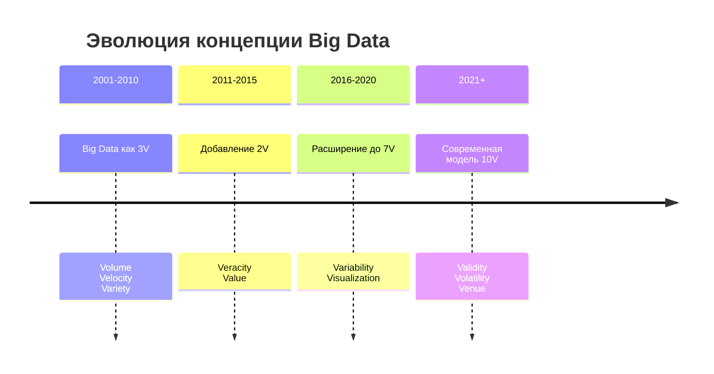

### Современные драйверы развития

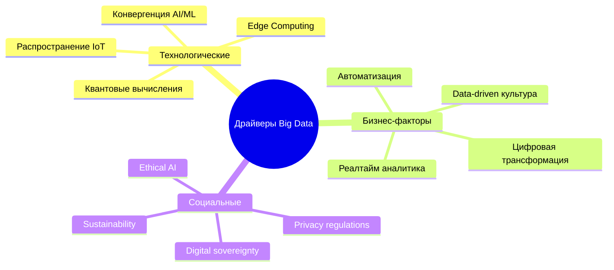

## 2. Архитектурные парадигмы: Data Fabric и Data Mesh

### Сравнительный анализ архитектурных подходов

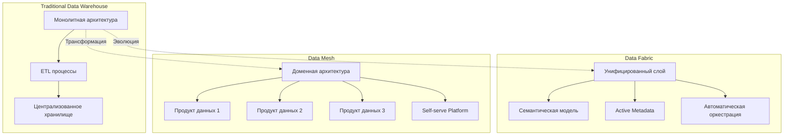

### Data Fabric: Интегрированная архитектура

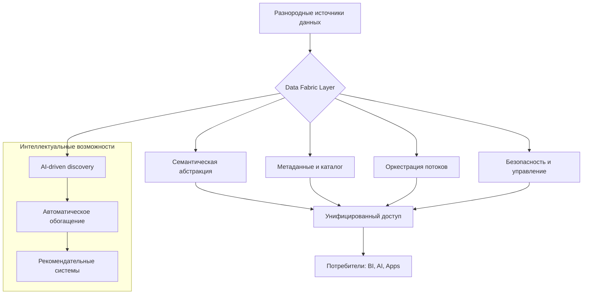

### Data Mesh: Принципы и реализация

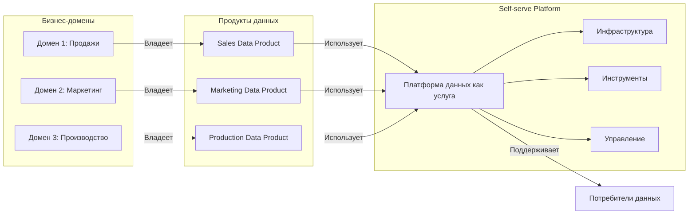

## 3. Конвергенция Big Data и Искусственного Интеллекта

### AI-управляемый цикл данных

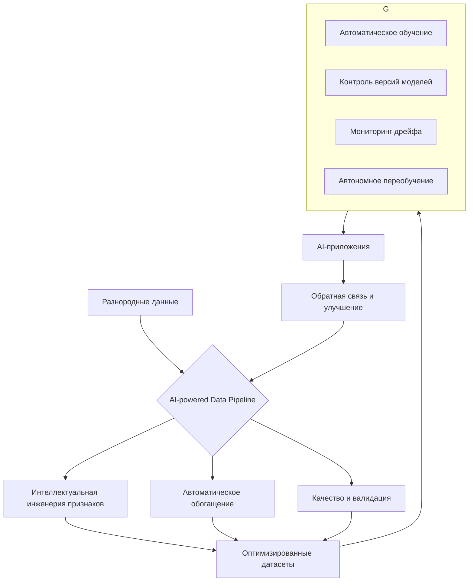

### Современный стек технологий AI/Data

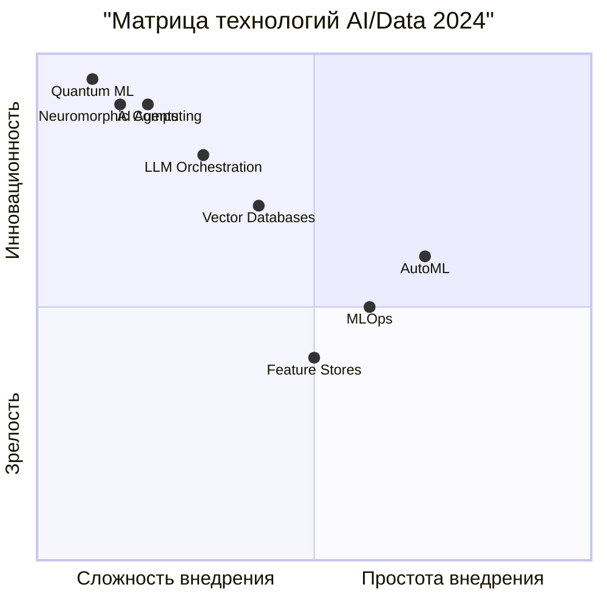

## 4. Интернет вещей (IoT) как источник данных нового поколения

### Архитектура IoT-аналитики

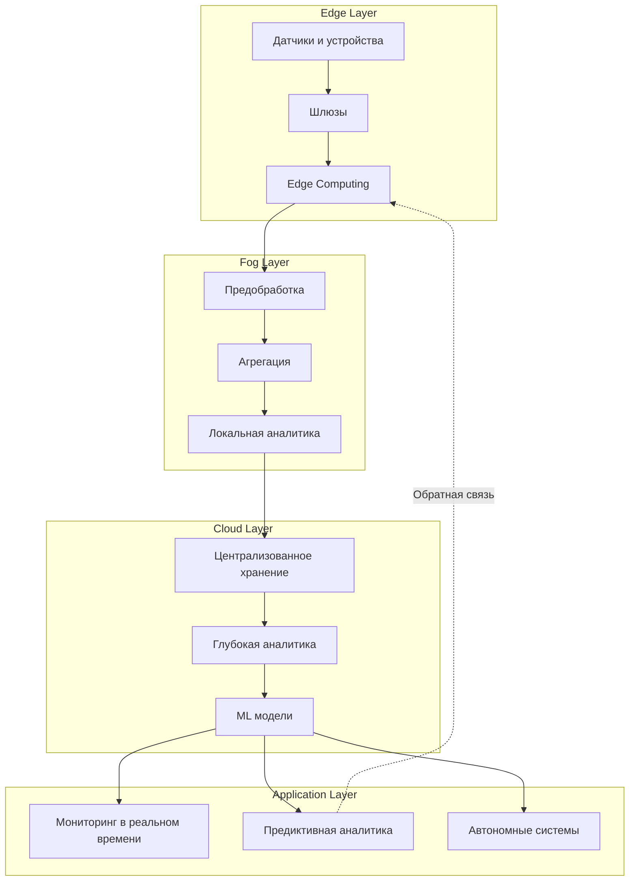

### Потоковая обработка IoT-данных

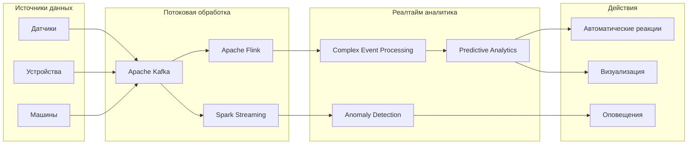

## 5. Тенденции цифровой трансформации

### Конвергенция технологий

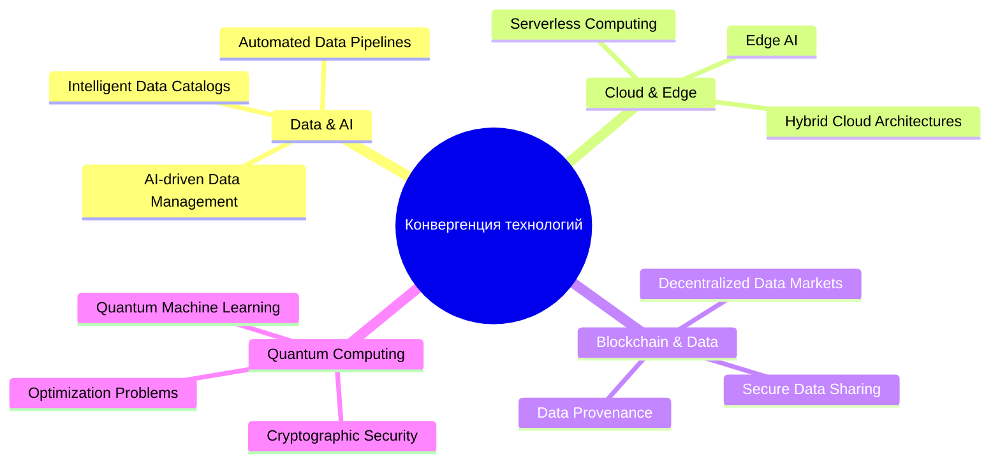

### Эволюция ролей и компетенций

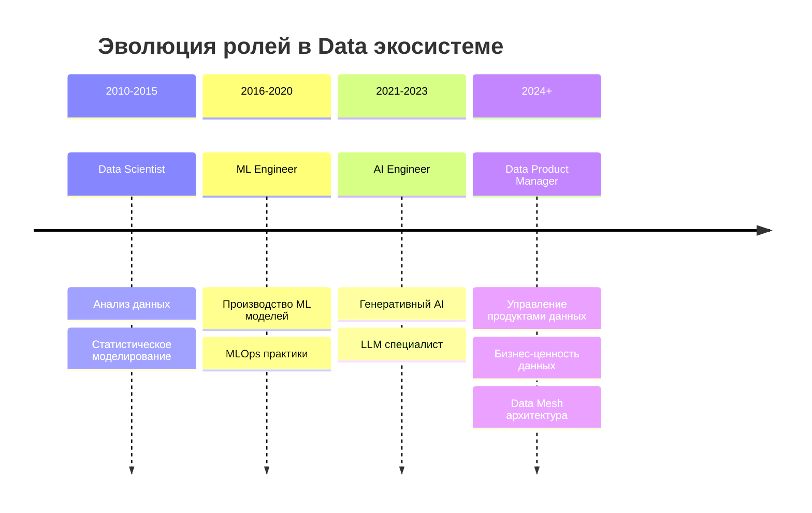

## 6. Будущие направления и вызовы

### Emerging Technologies Roadmap

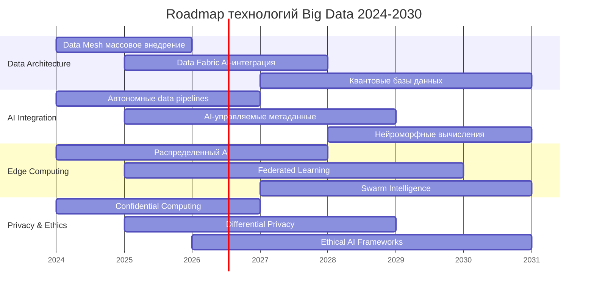

### Ключевые технологические вызовы

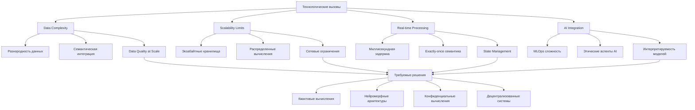

## 7. Заключение: Стратегические рекомендации

### Критические успешные факторы

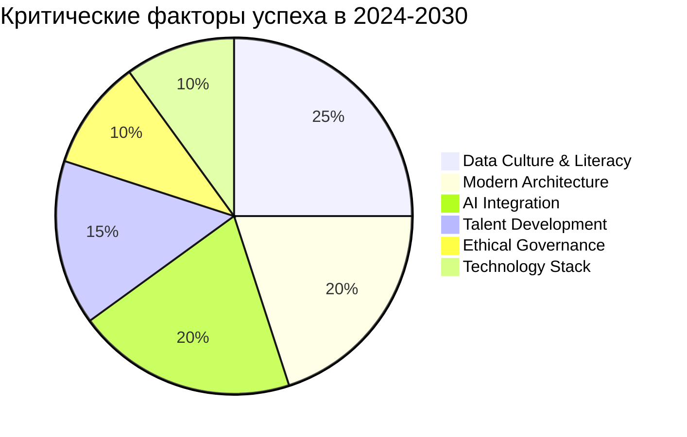

### Стратегическая матрица приоритетов

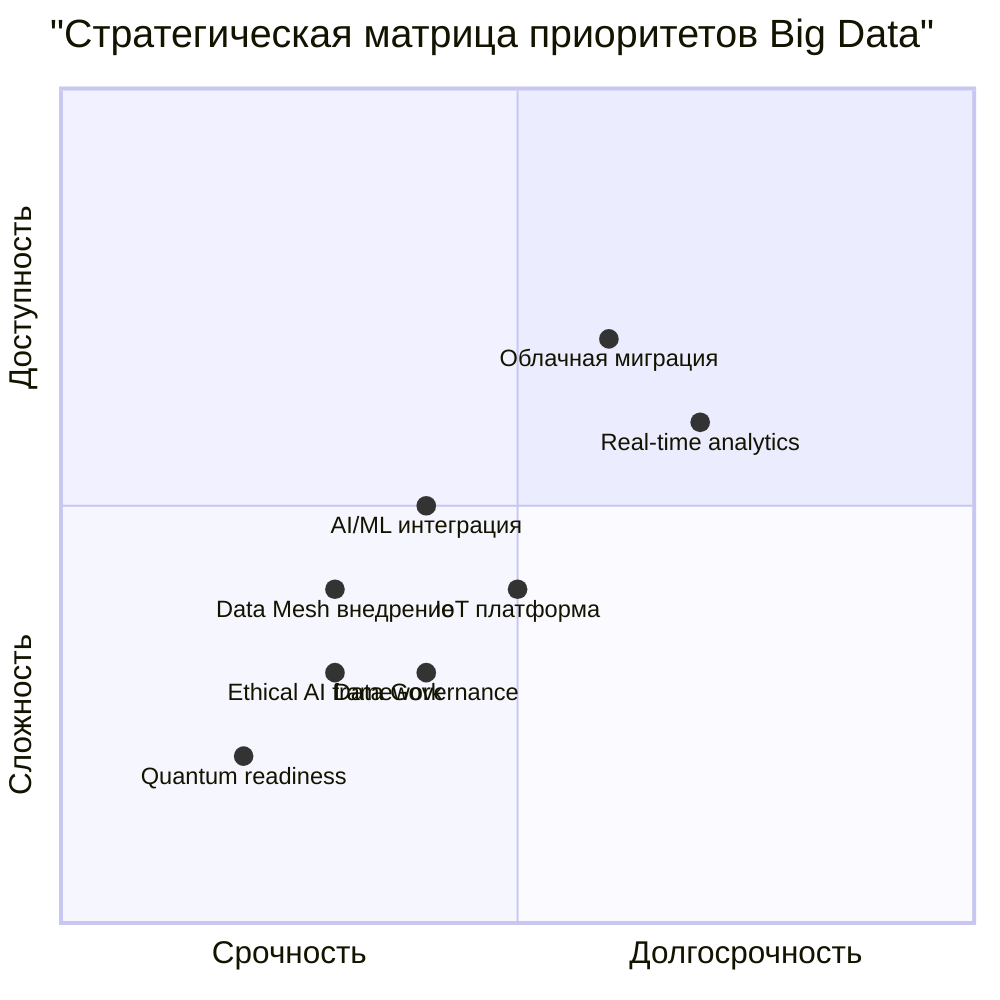

## Ключевые выводы

1. **Сдвиг парадигмы** от централизованных хранилищ к децентрализованным экосистемам данных
2. **Конвергенция технологий** создает новые возможности для инноваций
3. **AI становится неотъемлемой частью** управления данными, а не только их потребителем
4. **Реалтайм-обработка** становится стандартом, а не опцией
5. **Этические и регуляторные аспекты** приобретают критическую важность
6. **Непрерывное обучение и адаптация** - ключевой навык для профессионалов в области данных

Будущее Big Data лежит в создании интеллектуальных, автономных и этичных экосистем данных, которые не только хранят и обрабатывают информацию, но и генерируют ценность, предсказывают тренды и принимают оптимальные решения в реальном времени.